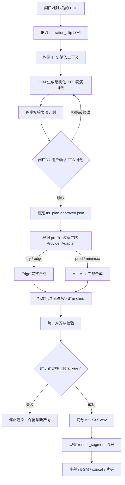

# TTS 供应商适配层与付费前确认闸口方案（v1.0.6）

> 日期：2026-08-28  
> 状态：代码已实施；prod 5 句付费小样已通过，长稿大样待验收  
> 范围：阶段 6.5 TTS 表演计划、阶段 7 语音合成、供应商适配层、闸口与成本控制  
> 关联文档：  
> - `docs/2026/0817-v1.0.0-长视频浓缩工作流.md`  
> - `docs/2026/0827-MiniMax-TTS语气与停顿控制研究.md`  
> - `docs/2026/0824-v1.0.5-多供应商LLM路由与解说模型分层方案.md`

---

## 1. 结论

v1.0.6 不把 TTS 简单理解成「逐句调用某个云服务」，而是建立统一的 TTS 供应商适配层：

1. **dry 模式使用微软 Edge TTS**，不消耗 TTS 费用，用于验证主流程。
2. **prod 模式由用户指定供应商，默认 MiniMax**。
3. **dry 与 prod 的主流程保持一致**：完整合成 → 获取字/词级时间轴 → 按语义片段切分 → 交给现有渲染器。
4. dry 与 prod 的差异只允许出现在 **provider、model、voice、供应商能力适配**，不允许出现两条不同的剪辑流程。
5. 付费 TTS 前新增**闸口 3：TTS 表演计划确认**。用户确认发音、停顿、语气、供应商、模型、成本估算后，程序才允许发起完整合成。
6. Edge TTS 与 MiniMax 都实测具备时间边界能力，可以支撑「一次完整合成，再切回逐句 WAV」的主流程。

本方案中的「微软 TTS」指当前项目已经使用的 **Edge TTS 免费读取接口**，不是 Azure Speech 收费服务。Edge TTS 只作为 dry 验证路径；prod 默认使用 MiniMax。

---

## 2. 背景与问题

当前 `stage_render.synthesize()` 已经是一个很薄的隔离点，但真实流程仍然存在三个问题：

1. **流程与供应商耦合不足**：现有 Edge 路径是逐句合成；如果 prod MiniMax 改成完整合成后切分，就会出现 dry 与 prod 两条不同主流程。这样 dry 验证的不再是真实链路。
2. **缺少付费前确认点**：正式合成一篇 15 分钟解说稿会产生明显成本。如果发音、停顿、语气或选错音色，失败重试会继续增加成本。
3. **表演控制散落在文本里**：如果 LLM 或程序直接把 `<#0.35#>`、`(breath)`、拼音替换写入解说正文，会污染字幕、剪映文本和后续编辑数据。

因此，v1.0.6 的目标不是只接入 MiniMax，而是先把 TTS 流程抽象成稳定的内部契约，再让不同供应商适配这个契约。

---

## 3. 目标与非目标

### 目标

1. 建立统一 TTS 适配层，初始支持：
   - `edge`：dry 默认供应商；
   - `minimax`：prod 默认供应商。
2. dry 与 prod 使用同一主流程：
   - 构建 TTS 计划；
   - 用户确认计划；
   - 完整合成；
   - 解析字/词级时间戳；
   - 切回每个 `narration_clip` 对应的 WAV；
   - 进入现有渲染、字幕、BGM、剪映导出。
3. 新增闸口 3，在真实 TTS 前确认：
   - 每句发音修正；
   - 停顿位置与时长；
   - 语气与情绪；
   - provider、model、voice；
   - 预估计费字符与费用；
   - 是否存在供应商不支持的能力降级。
4. 使用 LLM 生成结构化 TTS 表演计划，但 LLM 不得修改解说事实文本。
5. 表演指令与字幕文本分离：
   - `narration.json`、SRT、ASS、剪映文本保持干净；
   - 供应商标记只存在于发送给 TTS 的 payload。
6. 保留完整产物链路：
   - `tts_plan.json`；
   - `tts_plan.approved.json`；
   - 完整音频；
   - 字/词时间戳；
   - 切分后的 `tts_XXX.wav`；
   - 切分元数据。
7. 为后续接入火山、豆包、Azure Speech、CosyVoice 等供应商预留同一接口。

### 非目标

1. 本期不正式更换默认解说音色。MiniMax 候选音色仍需账户侧可用性确认和试听。
2. 本期不追求 dry 与 prod 音色一致。dry 的意义是验证程序链路，不是预览最终音色。
3. 本期不接入 Azure Speech 收费服务。
4. 本期不把 MiniMax 异步长文本接口作为主路径，因为当前公开文档中未见其等同的字幕时间戳能力。
5. 本期不在 LLM 失败时静默退化成无表演计划。没有确认的 TTS 计划，prod 不允许合成。

---

## 4. 统一主流程

### 4.1 流程图



### 4.2 关键原则

#### 4.2.1 完整合成是唯一主策略

v1.0.6 统一采用：

```text
full_then_split
```

Edge 不再走特殊的逐句合成路径。dry 也应把当前任务中的全部 `narration_clip` 按最终 EDL 顺序拼成完整输入，交给 Edge 合成，再切回片段级 WAV。

这样 dry 验证的链路与 prod 相同：

1. 闸口后的 EDL 是否正确进入 TTS；
2. TTS 计划是否稳定；
3. 完整音频是否能与 manifest 对齐；
4. 片段 WAV 是否能还原回渲染器；
5. 字幕和剪映导出是否仍能工作。

#### 4.2.2 供应商差异只留在 Adapter 内

主流程只认识统一对象，不认识 MiniMax 的 `<#x#>`，也不认识 Edge 的 `WordBoundary`。

供应商 Adapter 负责：

| 职责 | Edge Adapter | MiniMax Adapter |
|---|---|---|
| 构造供应商请求 | 构造 `edge_tts.Communicate` | 构造 `/v1/t2a_v2` JSON |
| 认证 | 无密钥 | Bearer Token |
| 发起完整合成 | stream 收集音频与边界 | HTTP 请求并下载音频 |
| 获取时间边界 | `WordBoundary` | `subtitle_file` |
| 时间单位换算 | 100ns 单位转 ms | JSON 中已经是毫秒或浮点毫秒 |
| 停顿能力 | 原生不支持，由统一 splitter 补静音 | 原生 `<#x#>` |
| 语气词能力 | 原生不支持，降级为停顿或忽略 | `(breath)`、`(sighs)` 等 |
| 发音修正 | 无字典能力，需警告 | `pronunciation_dict.tone` |
| 音频规范化 | MP3 转 48kHz mono WAV | WAV/MP3 转 48kHz mono WAV |

#### 4.2.3 表演指令是中间表示，不是文本补丁

LLM 不直接输出某家供应商的最终文本，而是输出供应商无关的表演计划：

```json
{
  "schema_version": "tts_plan_v1",
  "segments": [
    {
      "index": 0,
      "narration_id": 1,
      "source_text": "城里的线索断了，派蒙提议去找图书管理员丽莎。",
      "performance": {
        "pause_before_ms": 0,
        "pause_after_ms": 350,
        "tone": null,
        "emotion": "calm",
        "speed_hint": 1.0
      },
      "pronunciations": [],
      "warnings": []
    }
  ]
}
```

`source_text` 必须与 EDL 中对应 `narration_clip.text` 完全一致。LLM 只能补充表演信息，不能改写事实文本。

MiniMax Adapter 可以把表演计划编译成：

```text
<#0.35#>下一句正文。(sighs)
```

Edge Adapter 编译时移除 unsupported 标记，只在统一切分阶段补静音。两者对外都生成相同的切分产物结构。

---

## 5. 闸口 3：TTS 计划确认

### 5.1 定位

现有闸口：

| 闸口 | 内容 | 控制点 |
|---|---|---|
| 闸口 1 | 解说稿审阅 | LLM 写稿后 |
| 闸口 2 | 分镜板 / EDL 审阅 | 选片与保留区间后 |
| 闸口 3 | TTS 表演计划审阅 | 付费 TTS 前 |

闸口 3 不重新审剧情，也不重新选片。它只确认「这些确认后的句子准备怎么被读出来」。

### 5.2 触发时机

闸口 2 确认后，程序读取最终 EDL，提取全部 `narration_clip`，生成 TTS 表演计划。

`raw_insert` 不进入 TTS 文本，也不产生语音成本。它只保留在 EDL 中，后续渲染时插入原声原画。

### 5.3 用户看到的信息

闸口 3 至少展示：

| 字段 | 说明 |
|---|---|
| 序号 / narration_id | 与 EDL、字幕、渲染日志一致 |
| 原文 | 与 `narration_clip.text` 完全一致 |
| 发音修正 | 例如专有名词、多音字 |
| 停顿 | 句前、句后或关键标点后的毫秒数 |
| 语气 | `(breath)`、`(sighs)` 等中间表示 |
| 情绪 | calm、surprised、sad 等 |
| 供应商能力降级警告 | 例如 Edge 不支持某语气 |
| provider / model / voice | 即将使用的真实配置 |
| 预估计费字符 | 按供应商规则计算 |
| 预估费用 | TTS 费用，不含 LLM 计划费用 |

### 5.4 审批机制

建议产物：

```text
tasks/{task_id}/tts_plan.json
tasks/{task_id}/tts_plan.html
tasks/{task_id}/tts_plan.approved.json
```

`tts_plan.approved.json` 至少包含：

```json
{
  "schema_version": "tts_approval_v1",
  "plan_sha256": "...",
  "provider": "minimax",
  "model": "speech-2.8-hd",
  "approved_at": "2026-08-28T00:00:00+08:00",
  "approved_by": "user"
}
```

后续 TTS 和渲染必须满足：

1. `tts_plan.approved.json` 存在；
2. `plan_sha256` 与当前 `tts_plan.json` 一致；
3. provider、model、voice 未变化；
4. EDL 中对应 `narration_clip.text` 未变化；
5. 供应商配置指纹未变化。

任何一项变化都必须重新生成计划并重新确认。

### 5.5 CLI 形态

建议新增：

```bash
mmm run tts-plan --task hd-16-all
```

生成计划并停在闸口 3。

用户确认后：

```bash
mmm tts-approve --task hd-16-all --plan-sha256 <sha256>
```

然后执行：

```bash
mmm run tts --task hd-16-all
```

`mmm run render --task hd-16-all` 可以复用已生成的片段 WAV；若片段缺失，则要求存在已批准的 TTS 计划。

---

## 6. LLM 表演计划生成

### 6.1 职责

LLM 负责把「确认后的解说文本」转成「适合朗读的表演计划」，重点包括：

1. 判断哪里适合停顿；
2. 判断哪些句子适合语气词；
3. 标记情绪方向；
4. 找出可能读错的游戏专有名词、多音字；
5. 输出结构化 JSON，而不是自由文本。

LLM 不负责：

1. 修改叙事事实；
2. 润色句子；
3. 删除或合并解说句；
4. 决定供应商；
5. 直接输出 MiniMax 或 Edge 专属语法。

### 6.2 输入上下文

建议输入：

1. 闸口 2 后的 EDL；
2. 每个 `narration_clip` 的 `narration_id` 和文本；
3. 系列解说风格；
4. 当前 TTS profile；
5. 供应商能力声明；
6. 已知专有名词表；
7. 最近若干句上下文，避免孤立判断节奏。

不需要输入完整源视频画面描述。TTS 表演计划主要服务于声音，不需要重新理解剧情。

### 6.3 输出约束

LLM 输出必须是严格 JSON：

```json
{
  "schema_version": "tts_plan_v1",
  "segments": [
    {
      "index": 0,
      "narration_id": 1,
      "source_text": "城里的线索断了，派蒙提议去找图书管理员丽莎。",
      "performance": {
        "pause_before_ms": 0,
        "pause_after_ms": 250,
        "tone": null,
        "emotion": "calm",
        "speed_hint": 1.0
      },
      "pronunciations": [],
      "warnings": []
    }
  ]
}
```

程序必须做确定性校验：

1. `segments` 数量与 EDL 中 `narration_clip` 数量一致；
2. `index` 连续；
3. `narration_id` 一致；
4. `source_text` 与 EDL 完全一致；
5. `pause_before_ms`、`pause_after_ms` 在允许范围内；
6. `tone` 属于供应商能力交集或标明降级；
7. `emotion` 属于供应商支持集合；
8. 发音规则格式合法；
9. JSON 中不得出现额外文本。

校验失败不自动重试高成本模型，应保留失败产物并让用户决定是否重跑。

### 6.4 与供应商能力的关系

LLM 输出的能力是「意图」，供应商能力声明决定「如何实现」。

| 意图 | MiniMax | Edge |
|---|---|---|
| 停顿 350ms | `<#0.35#>` | 统一 splitter 插入 350ms 静音 |
| 叹气 `(sighs)` | 原生语气词 | 不支持，忽略或转为短停顿 |
| 情绪 sad | `voice_setting.emotion=sad` | 不支持参数级 emotion，忽略 |
| 发音修正 | `pronunciation_dict.tone` | 无等效能力，闸口警告 |

能力差异必须在闸口 3 显示，不能静默吞掉。

---

## 7. 统一数据结构

### 7.1 TtsSegment

表示一个待合成语义片段：

```python
@dataclass
class TtsSegment:
    index: int
    narration_id: int
    source_text: str
    pause_before_ms: int
    pause_after_ms: int
    tone: str | None
    emotion: str | None
    speed_hint: float
    pronunciations: list[PronunciationRule]
```

### 7.2 TtsPlan

表示闸口 3 审批对象：

```python
@dataclass
class TtsPlan:
    schema_version: str
    profile: str
    provider: str
    model: str
    voice: str
    strategy: str
    segments: list[TtsSegment]
    estimated_billing_characters: int
    estimated_cost: CostEstimate
```

### 7.3 WordTimeline

所有供应商都必须归一化为：

```python
@dataclass
class WordTiming:
    text: str
    char_start: int
    char_end: int
    start_ms: float
    end_ms: float
```

如果供应商返回的是词而不是字，例如 Edge 的「城里」「线索」，则 `char_start` 和 `char_end` 表示该词在归一化文本中的范围。

### 7.4 TtsArtifact

切分后交给渲染器的统一对象：

```python
@dataclass
class TtsArtifact:
    index: int
    narration_id: int
    wav_path: Path
    duration_s: float
    speech_start_ms: float
    speech_end_ms: float
    plan_sha256: str
```

文件名保持：

```text
render_segments/tts_000.wav
render_segments/tts_001.wav
```

这样 `stage_render` 和 `stage_jianying` 的后续改动最小。

---

## 8. 配置设计

### 8.1 profile 结构

```yaml
tts:
  profile: dry
  strategy: full_then_split
  profiles:
    dry:
      provider: edge
      model: edge-neural
      voice: zh-CN-XiaoyiNeural
      speed: 1.1
    prod:
      provider: minimax
      model: speech-2.8-hd
      voice_id: 待确认
      speed: 1.1
      emotion: calm
      audio:
        sample_rate: 44100
        format: wav
        channel: 1
```

`profile` 只决定加载哪一组模型配置。后续执行流程完全相同。

### 8.2 环境变量

MiniMax 密钥只放 `.env`：

```bash
MMM_MINIMAX_TTS_API_KEY=
```

要求：

1. `.env` 已在 `.gitignore`；
2. 日志不得打印 Key；
3. task.json 不得保存 Key；
4. 请求错误展示 `trace_id`，不展示 Authorization；
5. 配置指纹只记录 Key 是否存在或哈希摘要，不记录原文。

Edge TTS 不需要 Key。

### 8.3 模型与模式关系

| 模式 | provider | 用途 | TTS 费用 |
|---|---|---|---|
| dry | edge，固定 | 验证程序链路 | 免费 |
| prod | 用户指定，默认 minimax | 正式成片 | 按供应商计费 |

后续增加供应商时，只新增 provider adapter 和 profile，不改渲染主流程。

---

## 9. MiniMax 调研与实测

### 9.1 接口基本信息

同步 T2A v2：

```text
POST https://api.minimaxi.com/v1/t2a_v2
Authorization: Bearer <MMM_MINIMAX_TTS_API_KEY>
```

备用地址：

```text
https://api-bj.minimaxi.com/v1/t2a_v2
```

官方文档：

- 同步语音合成 HTTP：<https://platform.minimax.cn/docs/api-reference/speech-t2a-http>
- 系统音色列表：<https://platform.minimax.cn/docs/faq/system-voice-id>
- 按量计费：<https://platform.minimax.cn/docs/guides/pricing-paygo>
- 速率限制：<https://platform.minimax.cn/docs/guides/rate-limits>

### 9.2 请求能力

当前可选模型包括：

```text
speech-2.8-hd
speech-2.8-turbo
speech-2.6-hd
speech-2.6-turbo
speech-02-hd
speech-02-turbo
speech-01-hd
speech-01-turbo
```

v1.0.6 prod 默认建议：

```text
provider: minimax
model: speech-2.8-hd
```

小样验证可以使用 `speech-2.8-turbo` 降低成本。

文本限制：

| 项目 | 说明 |
|---|---|
| 同步接口文本长度 | 小于 10000 字符 |
| 官方建议 | 大于 3000 字符时使用流式输出 |
| 段落 | 支持换行符表示段落切换 |
| 本项目典型稿量 | 15 分钟约 4000 中文字，同步接口可承载，但长文本边界仍需大样验证 |

音频设置：

| 参数 | 可选范围 |
|---|---|
| sample_rate | 8000、16000、22050、24000、32000、44100 |
| format | mp3、pcm、flac、wav、pcmu_raw、pcmu_wav、opus |
| channel | 1 或 2 |
| bitrate | 32000、64000、128000、256000，主要对 mp3 生效 |

本项目统一输出 48kHz mono WAV，因此请求侧使用 44100 或 32000 均可，最终由 ffmpeg 转码到 48kHz。

### 9.3 停顿语法

MiniMax 使用文本内标记：

```text
前一句。<#0.45#>后一句。
```

规则：

| 规则 | 说明 |
|---|---|
| 格式 | `<#x#>` |
| 单位 | 秒 |
| 范围 | `0.01 <= x <= 99.99` |
| 精度 | 最多两位小数 |
| 位置 | 必须夹在两段可发音文本之间 |
| 连续性 | 不能连续放置多个停顿标记 |

因此，句间停顿不能简单放在某个片段的开头而没有前文。完整合成后切分是更自然的方案。

### 9.4 语气词标签

语气词仅 `speech-2.8-hd` 和 `speech-2.8-turbo` 支持。官方列出：

```text
(laughs)
(chuckle)
(coughs)
(clear-throat)
(groans)
(breath)
(pant)
(inhale)
(exhale)
(gasps)
(sniffs)
(sighs)
(snorts)
(burps)
(lip-smacking)
(humming)
(hissing)
(emm)
(sneezes)
```

本项目初期建议只启用少量：

| 语气词 | 用法 |
|---|---|
| `(breath)` | 长句中后段、镜头切换后的自然换气 |
| `(sighs)` | 遗憾、牺牲、误会揭开后的余韵 |
| `(chuckle)` | 极少量人物反差或幽默节点 |
| `(gasps)` | 关键反转，慎用 |

其余语气词默认不进入闸口 3 的候选，避免表演过度。

### 9.5 情绪参数

`voice_setting.emotion` 官方枚举：

```text
happy
sad
angry
fearful
disgusted
surprised
calm
fluent
whisper
```

注意：

1. 官方说明模型通常会根据文本自动匹配合适情绪，一般无需手动指定；
2. `speech-2.8-hd` 和 `speech-2.8-turbo` 不支持 `whisper`；
3. `fluent` 在 2.8 系列上的实际效果仍需试听；
4. 本项目初期只建议启用 `calm`、`surprised`、`sad` 三档，其他情绪必须经过小样确认。

### 9.6 发音修正

MiniMax 支持发音字典：

```json
{
  "pronunciation_dict": {
    "tone": [
      "处理/(chu3)(li3)",
      "郑栅洁/(zheng4)(shan1)杰"
    ]
  }
}
```

规则格式：

```text
原文/替换内容
```

替换内容可以是：

1. 带声调普通话拼音；
2. IPA；
3. 粤语拼音；
4. 日语假名或罗马音；
5. 普通文本替换。

本项目优先使用字典级发音修正，而不是每句正文内插拼音，避免污染文本和时间轴对齐。

### 9.7 字幕时间戳

请求参数：

```json
{
  "subtitle_enable": true,
  "subtitle_type": "word"
}
```

可选粒度：

```text
sentence
word
word_streaming
```

`word_streaming` 仅流式场景有效。v1.0.6 使用非流式完整合成，因此使用 `word`。

返回字段：

```json
{
  "data": {
    "audio": "音频 URL 或 hex",
    "subtitle_file": "字幕时间戳 JSON URL",
    "status": 2
  }
}
```

请求 `output_format=url` 时，`data.audio` 是下载 URL。官方说明 URL 有效期为 24 小时，程序必须立即下载并保存本地产物。

### 9.8 实测记录

测试日期：2026-08-28。

测试文本：

```text
城里的线索断了，派蒙提议去找图书管理员丽莎。
```

请求要点：

```json
{
  "model": "speech-2.8-turbo",
  "stream": false,
  "voice_setting": {
    "voice_id": "female-shaonv",
    "speed": 1.0,
    "vol": 1.0,
    "pitch": 0,
    "emotion": "calm"
  },
  "audio_setting": {
    "sample_rate": 44100,
    "bitrate": 128000,
    "format": "wav",
    "channel": 1
  },
  "subtitle_enable": true,
  "subtitle_type": "word",
  "output_format": "url"
}
```

结果：

| 项目 | 实测值 |
|---|---:|
| HTTP | 200 |
| base_resp.status_code | 0 |
| audio_length | 4597ms |
| WAV 实际时长 | 4.597551s |
| audio_size | 406668 bytes |
| word_count | 22 |
| usage_characters | 42 |
| audio_format | wav |
| audio_channel | 1 |

`subtitle_file` 下载后是 JSON 数组。本次只有一句，因此数组长度为 1。每个 segment 内含 `timestamped_words`，粒度到字和标点。

关键时间：

```text
第一字「城」：42.667ms → 384.000ms
最后字「莎」：3882.667ms → 4053.333ms
句号结束：4053.333ms → 4309.333ms
segment 结束：4497.551ms
完整 WAV 结束：4597.551ms
```

结论：

1. MiniMax 返回的时间戳足以定位每句真实发声区间；
2. 标点也出现在 `timestamped_words` 中，有利于精确对齐；
3. 句尾到完整音频末尾仍有约 100ms 尾部空间，适合保留自然余韵；
4. 切分时必须处理句尾静音归属，避免下一句字幕提前出现。

本次按 Turbo 价格估算：

```text
42 / 10000 * 2 = 0.0084 元
```

### 9.9 计费规则

官方按量价格：

| 模型 | 单价 |
|---|---:|
| speech-2.8-hd | 3.5 元 / 万计费字符 |
| speech-2.8-turbo | 2 元 / 万计费字符 |

计费字符规则：

| 类型 | 计费字符 |
|---|---:|
| 中文字 | 2 |
| 英文字母、标点、空格、回车、特殊符号 | 1 |

以 15 分钟、约 4000 中文字估算：

```text
4000 * 2 / 10000 * 3.5 = 2.8 元
```

实际费用受标点、数字、英文字母、失败重试影响。闸口 3 必须显示估算值，并保留 MiniMax 返回的 `usage_characters` 作为真实值。

### 9.10 速率限制

官方 T2A v2 速率：

| 用户类型 | RPM |
|---|---:|
| 免费用户 | 10 |
| 充值用户 | 20 |

完整合成把一篇稿压到一次请求，能显著降低 RPM 压力。失败重试仍必须指数退避，并避免自动无上限重试。

### 9.11 MiniMax 风险

1. 候选音色 `Chinese_playful_streamer_nv1`、`Chinese (Mandarin)_IntellectualGirl` 未出现在公开系统音色列表，必须用账户侧查询接口或控制台确认。
2. 加入 `<#x#>`、语气词、发音替换后，`timestamped_words` 的文本和索引行为仍需专项测试。
3. 完整合成失败会浪费整篇费用，因此必须先通过闸口 3，再做确定性校验。
4. 供应商可能调整接口、价格、音色或时间戳结构，适配层必须保存原始响应。
5. 长文本超过 3000 字符时官方推荐流式，但完整合成本期优先非流式；如果 4000 字长样失败，再评估分段策略，但不能让分段逻辑泄漏到渲染器。

---

## 10. 微软 Edge TTS 调研与实测

### 10.1 定位

项目当前使用 Python 包 `edge-tts` 接入微软 Edge 朗读接口。

本次验证环境：

```text
edge-tts 7.2.8
```

特点：

1. 不需要 API Key；
2. 当前项目已声明为可选依赖 `tts-edge`；
3. 适合 dry 模式；
4. 接口不是正式商用 SLA 服务，不应用于 prod 成片；
5. dry 模式使用它，是为了验证程序主流程，而不是预测最终音色。

### 10.2 默认边界类型

`edge_tts.Communicate` 默认：

```python
boundary="SentenceBoundary"
```

默认模式返回句级边界。要获得词级边界，需要显式设置：

```python
edge_tts.Communicate(
    text,
    voice="zh-CN-XiaoyiNeural",
    boundary="WordBoundary"
)
```

当前 `stage_render.tts_edge()` 使用 `.save()`，只保存音频，丢失边界事件。v1.0.6 必须改为 stream 收集音频和边界。

### 10.3 时间单位

Edge 返回的 `offset` 和 `duration` 使用 100ns 单位：

```python
offset_ms = raw_offset / 10_000
duration_ms = raw_duration / 10_000
end_ms = (raw_offset + raw_duration) / 10_000
```

Adapter 必须集中完成这个换算，避免渲染器知道供应商细节。

### 10.4 实测记录

测试日期：2026-08-28。

测试文本：

```text
城里的线索断了，派蒙提议去找图书管理员丽莎。
```

请求：

```python
edge_tts.Communicate(
    text,
    voice="zh-CN-XiaoyiNeural",
    rate="+0%",
    boundary="WordBoundary"
)
```

结果：

| 项目 | 实测值 |
|---|---:|
| WordBoundary 数量 | 12 |
| MP3 大小 | 29808 bytes |
| MP3 实际时长 | 4.968s |
| 采样率 | 24000 |
| 声道 | 1 |

词级边界：

```text
城里       100.0ms → 475.0ms
的         475.0ms → 562.5ms
线索       575.0ms → 925.0ms
断         937.5ms → 1200.0ms
了        1200.0ms → 1350.0ms
派蒙      1587.5ms → 1937.5ms
提议      1950.0ms → 2412.5ms
去        2525.0ms → 2712.5ms
找        2712.5ms → 2862.5ms
图书      2875.0ms → 3200.0ms
管理员    3212.5ms → 3662.5ms
丽莎      3675.0ms → 4087.5ms
```

结论：

1. Edge 能返回词级时间边界；
2. 边界不包含标点；
3. 中文分词可能是多字词，例如「城里」「线索」「派蒙」；
4. 最后一词结束于 4087.5ms，但 MP3 实际时长为 4968ms，说明存在尾部音频或编码填充；
5. 统一 splitter 必须按 manifest 句子对齐，不能假设音频末尾就是最后一个词结束点。

### 10.5 能力与限制

| 能力 | Edge TTS 实测/文档状态 |
|---|---|
| 免费调用 | 是 |
| API Key | 不需要 |
| 完整合成 | 可行，需大样验证 |
| 词级边界 | 支持 `WordBoundary` |
| 句级边界 | 支持 `SentenceBoundary` |
| 标点时间戳 | WordBoundary 不含标点 |
| 自定义停顿 | 无 MiniMax `<#x#>` 等效能力 |
| 语气词标签 | 不支持 |
| 情绪参数 | 不支持 MiniMax 式 emotion |
| 发音字典 | 不支持 |
| 音色稳定性 | 接口非正式商用 SLA，存在变化风险 |

Edge 可以表达：

```python
rate="+10%"
volume="+0%"
pitch="+0Hz"
```

但不适合承载本项目完整的表演计划。

### 10.6 dry 使用策略

Edge Adapter 在 dry 模式下：

1. 将全部 `narration_clip` 按 EDL 顺序拼成完整输入；
2. 使用 `boundary="WordBoundary"` 合成；
3. 收集 MP3 音频块与边界事件；
4. 将边界换算为统一 `WordTimeline`；
5. 与 manifest 对齐；
6. 切回 48kHz mono WAV；
7. 输出与 MiniMax 相同的 `TtsArtifact` 结构。

不支持的表演意图处理如下：

| 表演意图 | dry 行为 |
|---|---|
| 停顿 | 统一 splitter 插入静音 |
| 语气词 | 忽略或转为短停顿，并写 warning |
| emotion | 忽略，并写 warning |
| 发音修正 | 不应用，并写 warning |

这些降级必须进入 `tts_plan.html`，不能静默发生。

### 10.7 Edge 风险

1. Edge 接口不是正式商业 SLA，可能随时变化。
2. `edge-tts` 会按字节长度切分内部请求。长文本下 offset 是否始终全局连续，必须用 15 分钟级真实稿验证。
3. WordBoundary 不返回标点，manifest 对齐逻辑必须做归一化匹配。
4. 中文分词结果不稳定时，不能按固定字数切分，必须按返回词文本顺序匹配。
5. MP3 尾部填充可能影响时长，最终 duration 必须以转码后的 WAV ffprobe 结果为准。

---

## 11. 时间轴对齐与切分

### 11.1 对齐输入

统一对齐器接收：

1. `TtsPlan.segments`；
2. 供应商原始音频；
3. 供应商原始时间戳；
4. Adapter 归一化后的 `WordTimeline`。

### 11.2 对齐规则

对齐器按顺序消费 timeline，不允许跳段：

1. 将 `source_text` 归一化；
2. 移除或映射不影响发音的标点；
3. 将供应商返回的词文本与归一化文本顺序匹配；
4. 为每个 `narration_id` 记录第一个词起点和最后一个词终点；
5. 相邻片段之间不得重叠；
6. 片段顺序必须与 EDL 一致；
7. 任一片段匹配失败即整体失败。

### 11.3 切分边界

推荐策略：

| 边界 | 策略 |
|---|---|
| 片段起点 | 语音起点前留 20-50ms 保护垫 |
| 片段终点 | 将句间静音优先归给前一句 |
| 语气词 | 若供应商时间戳不含语气词，需要单独验证 |
| 第一段 | 可保留完整音频开头的前置静音 |
| 最后一段 | 保留到完整音频末尾，保留自然余韵 |
| 淡入淡出 | 切点处加 5-20ms，避免爆音 |

每段输出：

```text
render_segments/tts_000.wav
render_segments/tts_001.wav
```

同时输出元数据：

```text
render_segments/tts_timeline.json
```

### 11.4 校验

切分后必须检查：

1. WAV 数量等于 `narration_clip` 数量；
2. 每个 WAV 能被 ffprobe 读取；
3. 每段 duration 大于 0；
4. 所有段顺序与 EDL 一致；
5. 总时长与完整音频时长误差在允许范围内；
6. `speech_start_ms`、`speech_end_ms` 不越界；
7. provider、plan fingerprint 写入元数据；
8. 渲染时使用的是切分后的 WAV，而不是完整音频。

---

## 12. 成本与安全

### 12.1 成本控制

| 阶段 | 成本 | 控制方式 |
|---|---|---|
| 闸口 1 | LLM 解说稿费用 | 现有 narrate 路由控制 |
| TTS 计划 | LLM 调用费用 | 独立 route 或复用低成本 route，失败不自动重试 |
| 闸口 3 | 无 TTS 费用 | 用户确认前禁止 TTS |
| dry TTS | Edge 免费 | 仅限程序验证 |
| prod TTS | MiniMax 按字符计费 | 必须有 approved plan |
| 渲染 | 本地 CPU/GPU | 不重复合成已有 WAV |

### 12.2 缓存

TTS 结果缓存键应包含：

1. `plan_sha256`；
2. provider；
3. model；
4. voice；
5. speed；
6. emotion；
7. pronunciation dict；
8. adapter version；
9. request schema version。

只要 plan 或配置变化，旧产物不能静默复用。

### 12.3 密钥安全

MiniMax Key 只放：

```bash
.env
MMM_MINIMAX_TTS_API_KEY=
```

禁止：

1. 写入 Git；
2. 写入 task.json；
3. 打印到日志；
4. 写入错误消息；
5. 出现在 HTML 报告；
6. 保存到成片元数据。

---

## 13. 实施计划

### 阶段 A：适配层骨架

1. 新增 `src/mmm/tts/`；
2. 定义 `TtsPlan`、`TtsSegment`、`WordTimeline`、`TtsArtifact`；
3. 定义 `TTSProvider` Protocol；
4. 实现 provider registry；
5. 保留旧 `synthesize()` 兼容入口，内部逐步转发到新 runtime。

### 阶段 B：Edge dry adapter

1. 实现 `boundary="WordBoundary"`；
2. stream 收集音频和边界；
3. 转码 48kHz mono WAV；
4. 实现 manifest 对齐；
5. 实现统一 splitter；
6. 用 3 句、1 个 `raw_insert`、1 个长句做 dry 验证。

### 阶段 C：MiniMax prod adapter

1. 实现 Bearer 请求；
2. 下载 audio 和 subtitle JSON；
3. 解析 `timestamped_words`；
4. 实现发音字典、停顿、语气词编译；
5. 实现成本估算；
6. 用单句、3 句、长文本样逐级验证。

### 阶段 D：闸口 3

1. 新增 `tts-plan` 命令；
2. 接入 LLM 表演计划生成；
3. 实现确定性校验；
4. 生成 HTML 审阅报告；
5. 实现 approve 与 fingerprint 校验；
6. 禁止无审批的 prod TTS。

### 阶段 E：渲染集成

1. `stage_render.run()` 改为消费 `TtsArtifact`；
2. `stage_jianying.export()` 复用同一批 WAV；
3. 字幕仍读取干净 `narration.text`；
4. 日志记录 provider、model、plan fingerprint；
5. 全链 dry 验证；
6. 小额 prod 样片验证。

---

## 14. 验收标准

v1.0.6 完成必须满足：

1. dry 与 prod 使用同一 `full_then_split` 主流程；
2. dry provider 固定 Edge；
3. prod provider 默认 MiniMax，可由用户配置替换；
4. Edge 输出与 MiniMax 输出归一化为相同 `TtsArtifact` 结构；
5. 无 approved plan 时 prod TTS 拒绝执行；
6. LLM 不能修改解说事实文本；
7. 供应商标记不污染字幕、EDL、narration 和剪映文本；
8. `raw_insert` 不触发 TTS；
9. 每个片段 WAV 都能回溯 narration_id、plan fingerprint、provider、model；
10. 任一时间轴对齐失败会停止流程并保留诊断产物；
11. `.env` 中的 MiniMax Key 不进入日志和 Git；
12. dry 与 prod 都能通过现有渲染、字幕、BGM、片头、剪映导出链路。

---

## 15. 待确认项

| 编号 | 事项 | 说明 |
|---|---|---|
| Q1 | MiniMax 正式音色 | 需要用账户侧接口确认候选音色是否存在，并试听 |
| Q2 | prod 默认模型 | 方案默认 `speech-2.8-hd`；若预算优先，可改 `speech-2.8-turbo` |
| Q3 | LLM 表演计划路由 | 建议新增 `tts_plan` route；若复用 `narrate_low`，需确认成本和上下文 |
| Q4 | 停顿归属 | 默认句间静音归前一句；如果希望下一句画面提前进入，可改为可配置 |
| Q5 | Edge 长文本边界连续性 | 必须用真实 15 分钟稿验证 `edge-tts` 内部分片后的 offset |
| Q6 | MiniMax 表演标记后时间戳 | 必须验证 `<#x#>`、语气词、发音替换是否影响 `timestamped_words` |
| Q7 | 未来供应商优先级 | 火山、豆包、Azure Speech、CosyVoice 均可按同一 Adapter 接口接入 |

---

## 16. 与旧研究文档的关系

`docs/2026/0827-MiniMax-TTS语气与停顿控制研究.md` 记录了早期接口能力评估。其关于停顿、语气、情绪、发音字典的结论仍然有效，但接入方式由 v1.0.6 修正：

1. 不再把 Edge 定义成天然逐句 dry 流程；
2. 不再把 MiniMax 定义成另一条完整合成流程；
3. dry 与 prod 统一为完整合成后切分；
4. 供应商差异收敛到 Adapter；
5. 付费前增加闸口 3。

---

## 17. v1.0.6 实测补记

2026-08-28 使用独立任务 `tts-prod-smoke` 完成 5 句 prod 小样：

| 项 | 结果 |
|---|---|
| provider / model | minimax / speech-2.8-hd |
| 音色 | `Chinese (Mandarin)_IntellectualGirl` |
| 审批 | `tts_plan.approved.json` |
| 切分段数 | 5 |
| 片段时长 | 6.071s、6.115s、7.397s、5.173s、9.241s |

实测发现并修复两个 Adapter 缺陷：

1. MiniMax 会在词级时间轴中返回 `(gasps)`、`(chuckle)` 等语气标签。解析器现在跳过这些非正文标签。
2. 发音替换可能把一个原文词拆成多条时间项。解析器现在按同一原始词位置合并时间区间。

同时修复切分器的毫秒/秒换算错误。首次付费请求产出的完整音频和字幕被离线重新切分，未为了修复缺陷再次调用 MiniMax。
