# mini-movie-maker 全项目流程图

> 日期：2026-08-28  
> 版本基准：v1.0.6  
> 用途：给开发者和 Agent 一张完整路线图，说明输入、产物、闸口、费用边界和导出分支。  

---

## 1. 总览

项目主链路分为四段：

1. **素材与任务准备**：登记视频、建任务、确认剪辑配置。
2. **素材理解与解说稿**：镜头、语音、视觉、时间轴、解说稿。
3. **选片与语音表演**：EDL、TTS 表演计划、完整合成、切回片段 WAV。
4. **双出口**：ffmpeg 直出 MP4，或生成剪映草稿供人工精修。

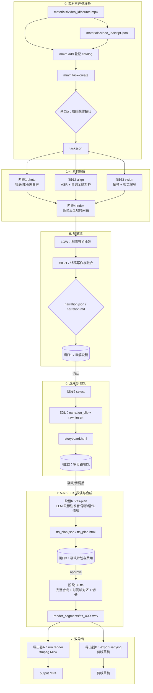

---

## 2. 素材登记与任务准备

### 2.1 输入契约

每个素材必须具备：

```text
materials/{video_id}/source.mp4
materials/{video_id}/script.jsonl
```

`script.jsonl` 是台词文稿，用于 ASR 对齐，不直接决定解说稿。

### 2.2 登记流程

```mermaid
flowchart TD
    A[本地素材] --> B{materials 文件存在？}
    B -->|否| X1[报错：缺少 source.mp4 或 script.jsonl]
    B -->|是| C[解析并预检 script.jsonl]
    C --> D[写入 SQLite catalog]
    D --> E[mmm task-create]
    E --> F[写入 task_map]
    F --> G[读取 config/series/{series}.yaml]
    G --> H[生成 tasks/{task_id}/task.json]
```

### 2.3 剪辑前配置确认

任务创建后，Agent 必须确认以下配置，再进入流水线：

| 配置 | 默认来源 | 影响 |
|---|---|---|
| 输出分辨率 / FPS | `series.output` | 成片规格 |
| 字幕模式 | `series.subtitle_mode` | overlay / letterbox / none |
| transform | `series.transform` | 放大、位移、裁 LOGO/UID |
| BGM | `series.bgm_playlist` | 背景音乐轨 |
| 片头 | `series.composition` | 最终拼接 |
| TTS profile | `series.tts.profile` | dry 或 prod |
| prod provider / model / voice | `series.tts.prod` | 正式语音供应商 |
| 目标时长 | `series.target_minutes` | 选片预算 |
| 保留区间 | `keep_requirements` | raw_insert 原声段 |

确认结果落盘：

```text
tasks/{task_id}/task.json
```

---

## 3. 素材预处理

### 3.1 阶段1：镜头切分

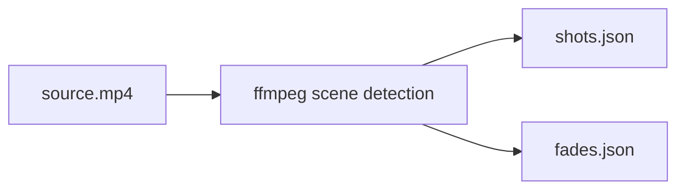

产物：

| 文件 | 内容 |
|---|---|
| `workspace/{video_id}/shots.json` | 镜头边界、时长、索引 |
| `workspace/{video_id}/fades.json` | 黑屏/白屏过渡 |

### 3.2 阶段2：ASR 与台词对齐

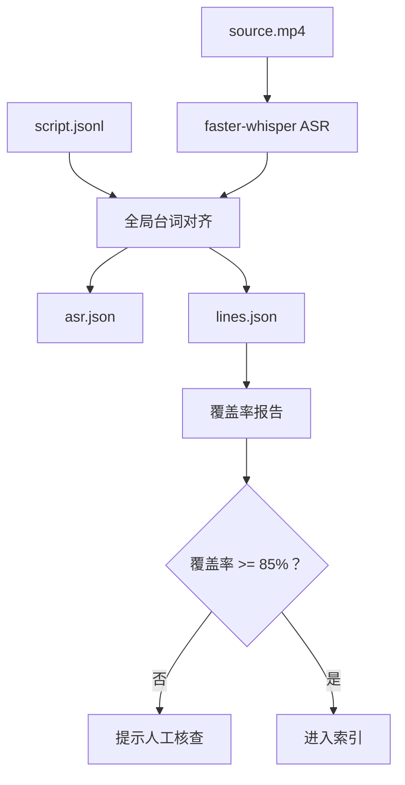

任务模式会把多个视频的 ASR 词流拼接后统一对齐，再按视频拆回本地时间。

### 3.3 阶段3：视觉理解

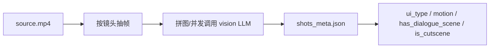

视觉结果只辅助分级和选片，不改写源视频。

### 3.4 阶段4：时间轴索引

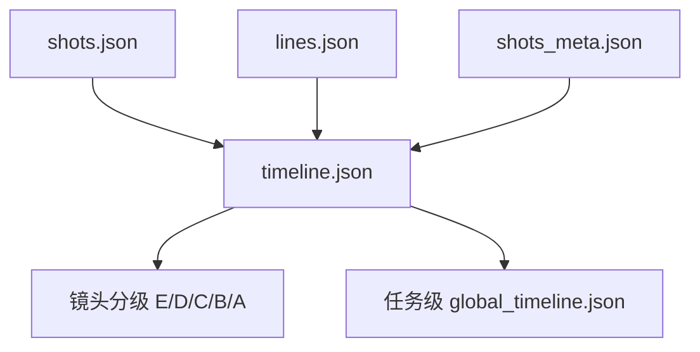

分级语义：

| 级别 | 含义 | 选片优先级 |
|---|---|---|
| E | 标志性过场 | 最高 |
| D | 无台词运镜 | 高 |
| C | 高动态画面 | 较高 |
| B | 对话/运动画面 | 中 |
| A | 静态对话或 UI 画面 | 低 |

---

## 4. 解说稿生成

### 4.1 LOW / HIGH 分层

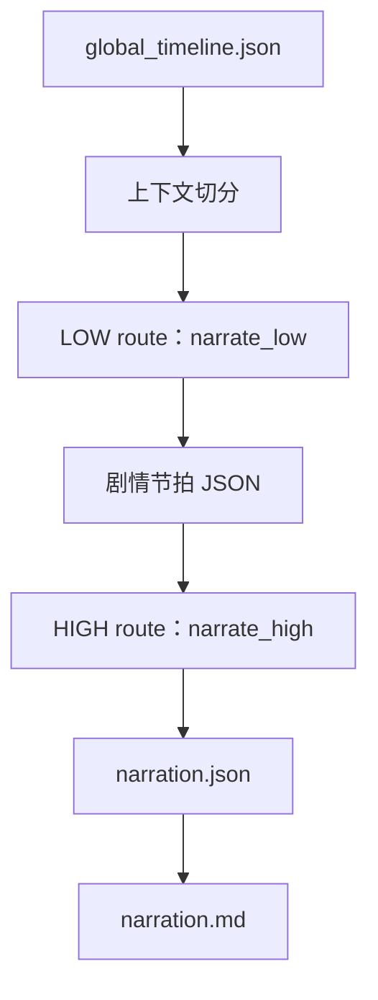

职责边界：

| 层 | 目标 | 不做 |
|---|---|---|
| LOW | 保留事实、因果、人物、关键台词 | 不追求文笔 |
| HIGH | 组织叙事节奏和终稿文风 | 不虚构 LOW 之外的事实 |

### 4.2 闸口1

产物：

```text
tasks/{task_id}/narration.json
tasks/{task_id}/narration.md
```

必须停在这里等用户审稿。用户确认后才能 `select`。

---

## 5. 选片与 EDL

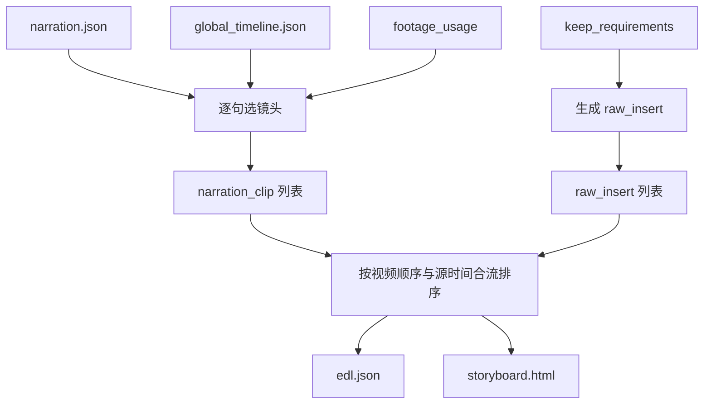

片段类型：

| 类型 | 画面 | 音频 | 是否进入 TTS |
|---|---|---|---|
| `narration_clip` | 按选定源区间裁切 | 使用 TTS WAV | 是 |
| `raw_insert` | 保留源画面 | 保留原声 | 否 |

闸口2 允许用户手改 EDL。之后所有阶段必须以 `edl.json` 为准。

---

## 6. TTS 表演计划与闸口3

### 6.1 生成流程

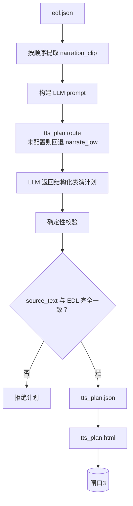

LLM 允许输出：

| 字段 | 示例 | 说明 |
|---|---|---|
| `pronunciations` | `安柏 / an1 bo2` | 术语、人名、多音字 |
| `pause_before_ms` | `300` | 句前停顿 |
| `pause_after_ms` | `450` | 句后停顿 |
| `tone` | `sighs` | 语气意图 |
| `emotion` | `sad` | 情绪方向 |
| `speed_hint` | `1.0` | 语速建议 |

LLM 不允许：

1. 修改 `source_text`；
2. 增删、合并、拆分解说句；
3. 直接输出 MiniMax 或 Edge 专属语法；
4. 替用户确认费用。

### 6.2 闸口3 与费用

产物：

```text
tasks/{task_id}/tts_plan.json
tasks/{task_id}/tts_plan.html
```

HTML 必须显示：

1. 每句原文；
2. 发音修正；
3. 停顿、语气、情绪；
4. provider / model / voice；
5. 预估计费字符和费用；
6. `plan_sha256`；
7. 供应商能力降级警告。

用户显式确认后执行：

```bash
mmm tts-approve --task <task_id> --plan-sha256 <plan_sha256>
```

产物：

```text
tasks/{task_id}/tts_plan.approved.json
```

费用规则：

| 模式 | TTS 费用 | 注意 |
|---|---|---|
| dry / edge | 免费 | 生成计划的 LLM 可能已计费 |
| prod / minimax | 按计费字符收费 | 确认后才合成；失败重试可能再次计费 |

---

## 7. 统一 TTS 适配层

### 7.1 主策略

dry 与 prod 都使用：

```text
full_then_split
```

即：

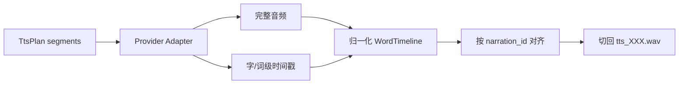

### 7.2 Provider 差异

| 能力 | Edge | MiniMax |
|---|---|---|
| 用途 | dry / 程序验证 | prod 默认 |
| Key | 不需要 | `MMM_MINIMAX_TTS_API_KEY` |
| 停顿 | 由 splitter 补静音 | `<#秒#>` |
| 语气词 | 不支持，降级 | `(breath)` 等 |
| 情绪 | 不支持，降级 | `voice_setting.emotion` |
| 发音字典 | 不支持，警告 | `pronunciation_dict.tone` |
| 时间边界 | `WordBoundary` | `subtitle_file` |

### 7.3 切分规则

1. 将 `source_text` 归一化成可发音字符流；
2. 按顺序消费供应商时间戳；
3. 每个 `narration_id` 得到真实发声区间；
4. 片段起点前留少量保护垫；
5. 句间静音优先归给前一句；
6. 输出统一为 48kHz mono WAV；
7. 每段时长以 ffprobe 实测为准。

产物：

```text
tasks/{task_id}/render_segments/tts_000.wav
tasks/{task_id}/render_segments/tts_001.wav
tasks/{task_id}/render_segments/tts_artifacts.json
```

---

## 8. 导出器A：ffmpeg MP4

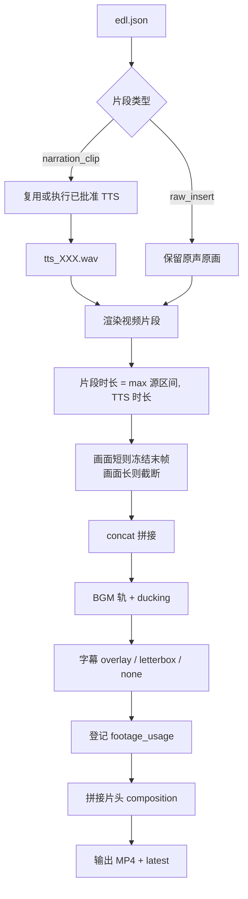

任务模式下渲染器会：

1. 校验 TTS plan 与 EDL；
2. 校验审批指纹；
3. 复用有效 `tts_artifacts.json`；
4. 若片段缺失且计划已批准，执行统一 TTS。

输出命名：

```text
output/{task_id}/{title}_YYYYMMDD_HHMMSS.mp4
output/{task_id}/{title}_latest.mp4
```

---

## 9. 导出器B：剪映草稿

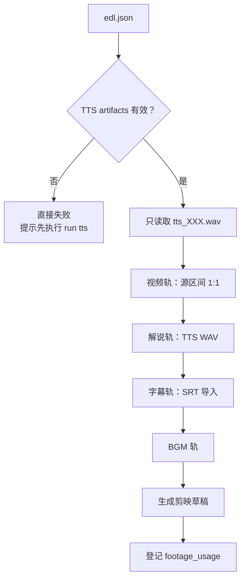

关键规则：

1. 剪映导出**不需要**先生成完整 MP4；
2. 剪映导出**不允许隐式触发 TTS**；
3. 缺失 `tts_artifacts.json` 或片段 WAV 时直接失败；
4. 剪映人工精修不回流到 `edl.json`。

因此推荐顺序是：

```bash
mmm run tts --task <task_id>
mmm export-jianying <task_id>
```

而不是期望剪映导出命令顺带合成语音。

---

## 10. 状态、缓存与断点续跑

### 10.1 状态记录

SQLite 记录任务与阶段状态：

```text
pipeline.sqlite
jobs(task_id, stage, status, message)
```

常见状态：

| 状态 | 含义 |
|---|---|
| `done` | 阶段完成 |
| `gate_waiting` | 等待人工审阅 |
| `approved` | 计划已确认 |
| `failed` | 执行失败 |

### 10.2 缓存原则

| 产物 | 复用条件 |
|---|---|
| 镜头 / ASR / vision / timeline | 输入和阶段产物仍存在 |
| narration 缓存 | route、prompt、timeline 指纹一致 |
| TTS 片段 | plan、provider、model、voice、profile 指纹一致 |
| MP4 | 新输出不覆盖历史 |

### 10.3 闸口总结

| 闸口 | 审阅对象 | 通过后 |
|---|---|---|
| 闸口0 | 剪辑配置 | 开始预处理 |
| 闸口1 | `narration.md` | `select` |
| 闸口2 | `storyboard.html` / `edl.json` | `tts-plan` |
| 闸口3 | `tts_plan.html` | `tts` |

### 10.4 费用触发点

| 命令 | 可能费用 |
|---|---|
| `narrate --dry-run` | 无 |
| `run narrate` | LLM |
| `run tts-plan` | LLM |
| `tts-approve` | 无 |
| `run tts` | dry 免费；prod TTS 计费 |
| `run render` | 本地算力；若 TTS 缺失且计划已批准，会触发 TTS |
| `export-jianying` | 本地算力；不触发 TTS |

---

## 11. 命令顺序

### 11.1 标准任务

```bash
mmm add <video_id> --series <series>
mmm task-create <task_id> --videos <video_id,...>

mmm run shots <video_id>
mmm run align --task <task_id>
mmm run vision <video_id>
mmm run index --task <task_id> --video <video_id>

mmm run narrate <task_id>
# 闸口1

mmm run select --task <task_id>
# 闸口2

mmm run tts-plan --task <task_id> --profile dry
# 闸口3
mmm tts-approve --task <task_id> --plan-sha256 <sha256>
mmm run tts --task <task_id>

mmm run render --task <task_id>
# 或
mmm export-jianying <task_id>
```

### 11.2 prod 模式

先在任务配置中显式设置：

```yaml
tts:
  profile: prod
  prod:
    provider: minimax
    model: speech-2.8-hd
    voice_id: <账户可用音色>
    speed: 1.0
    emotion: calm
    sample_rate: 44100
    format: wav
    channel: 1
```

再执行：

```bash
mmm run tts-plan --task <task_id> --profile prod
```

用户确认费用后才能继续。

---

## 12. 边界与失败处理

| 情况 | 行为 |
|---|---|
| LLM 修改解说文本 | TTS 计划生成失败 |
| TTS plan 被手改 | 指纹校验失败 |
| plan 已变化但审批旧 | 拒绝合成 |
| TTS 时间轴少词/乱序 | 停止切分 |
| TTS 片段缺失 | `run tts` 可执行；`export-jianying` 拒绝 |
| raw_insert 变化 | 重选片后必须重新走 TTS 计划校验 |
| 剪映草稿手调 | 不回流；最终成片仍以 EDL 口径登记 |

---

## 13. 产物地图

```text
materials/{video_id}/
  source.mp4
  script.jsonl

workspace/{video_id}/
  shots.json
  fades.json
  asr.json
  lines.json
  shots_meta.json
  timeline.json

tasks/{task_id}/
  task.json
  global_timeline.json
  narration.json
  narration.md
  edl.json
  storyboard.html
  tts_plan.json
  tts_plan.html
  tts_plan.approved.json
  render_segments/
    tts_000.wav
    tts_001.wav
    tts_artifacts.json
    seg_000.mp4

output/{task_id}/
  {title}_YYYYMMDD_HHMMSS.mp4
  {title}_latest.mp4
  bgm.wav
  edl.final.json
```

---

## 14. 冒烟路径

免台账冒烟用于开发调试：

```bash
mmm run shots --path <视频>
mmm run align --path <视频> --script <script.jsonl>
mmm run index --path <workspace>
mmm run narrate --timeline <timeline.json>
mmm run select --path <workspace>
mmm run render --path <workspace> --video <视频>
```

冒烟路径不适用任务模式的 TTS 闸口语义；正式任务必须走闸口0到闸口3。
