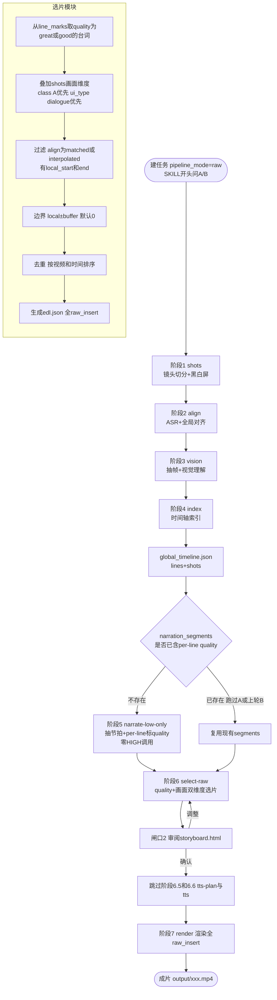
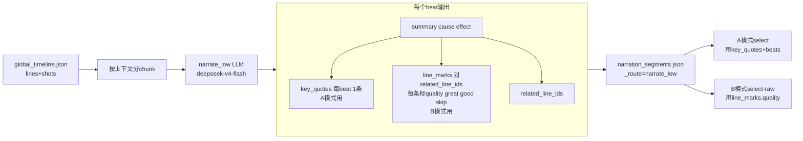
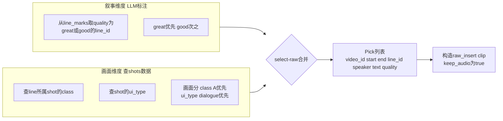
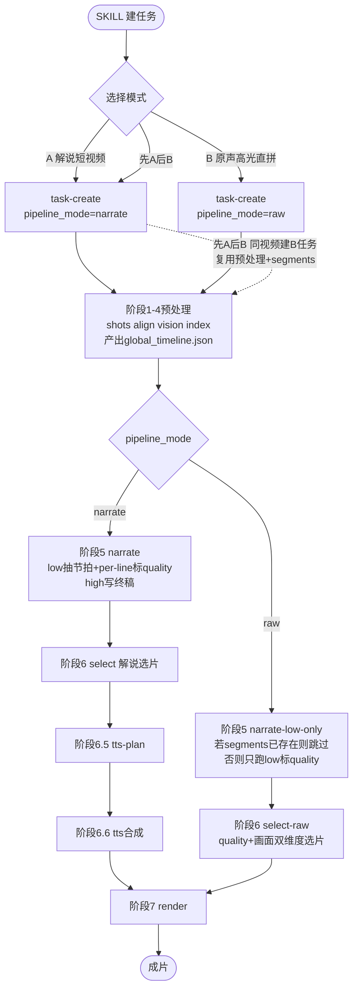
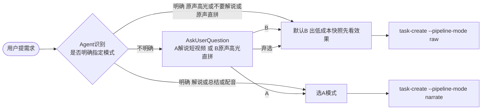

# B 模式：原声高光直拼 方案

> **版本**：v1.1.0 评审收口
> **日期**：2026/09/08 评审定稿，2026/09/08 实施完成
> **状态**：已实现（17 个 B 模式单测通过 + 36 个回归测试通过；端到端验证见 §10 验收清单）
> **关联**：`docs/2026/0828-全项目流程图.md`（A 模式全流程）、`experiments/b_mode/`（已验证 Demo）、`docs/2026/0824-v1.0.5-多供应商LLM路由与解说模型分层方案.md`（low/high 分层）、`docs/adr/0001-淘汰视频片尾彩蛋-成片模板统一四段式.md`

---

## 1. 背景与目标

### 1.1 为什么做

A 模式把长视频浓缩成「TTS 解说短视频」，链路重：解说稿生成（LLM）→ 选片 → TTS 表演计划 → 语音合成 → 渲染。EDL 里混着两类片段：

| clip 类型 | 作用 | 声音来源 |
|---|---|---|
| `narration_clip` | 解说句 + TTS 配音 | TTS 合成 |
| `raw_insert` | 原声高光段（`keep_audio:true`） | 源视频原声 |

**B 模式**去掉解说与 TTS，只从原始视频精选"原文高光段"直接拼接成片——成品就是一整条 `raw_insert` 组成的视频。适合"玩过游戏的人能脑补被切碎语境"的二次创作场景。

### 1.2 A/B 模式是两个独立模式

**重要定位**：A 模式与 B 模式目标不同、选片逻辑不同，**各自选入的片段不一样是正常的**，不要强行对齐：

| 维度 | A 模式 | B 模式 |
|---|---|---|
| 目标 | 浓缩成解说短视频（TTS 配音讲清剧情） | 原声高光直拼（保留原文对白魅力） |
| 选片依据 | 解说句逐句配画面（按 E→A 画面优先级） | 台词叙事价值（LLM 标注 quality）+ 画面维度 |
| 成品声音 | TTS 解说 + 少量原声 | 纯原声 |
| 片段集 | narration_clip 为主 | 全 raw_insert |

两者共享的只是**底层资源**：预处理产物（`global_timeline.json`）+ narrate_low 的 per-line 标注。选片各走各的，互不干扰。

### 1.3 已验证

Demo（`experiments/b_mode/`）已用 `hd-14-fhhj` 资源跑通两版成片：

| Demo | 挑选依据 | 片段数 | 时长 |
|---|---|---|---|
| A | 白嫖 `narration_segments` 的 `key_quotes`（LLM 标注金句） | 173 | 12.0min |
| ~~B~~ | ~~独立打分（长度+画面+UI+情绪+speaker）~~ | ~~346~~ | ~~23.9min~~ |

**Demo-B（独立打分）已放弃**——346 条/23.9min 过长，规则打分的"重要性"判断不如 LLM 语义判断准。B 模式统一走 **LLM 标注思路**（Demo-A 的精神），但把标注从稀疏的 `key_quotes`（每 beat 1 条）升级为**密集的 per-line quality**（每条相关台词都标）。

边界 buffer=0（精确贴合台词 `local_start/local_end`），Demo-A 观感达标（纯原声拼接、无 BGM/字幕/片头——指 Demo 验证时的成片形态，非 B 模式成片规格；成片模板见 §4.5）。

### 1.4 LLM 成本约束（硬性）

B 模式**不做总结终稿精写**，对 LLM 能力要求低。鉴于 HIGH LLM 费用约为 LOW 的 **20 倍**（参见 `0824` 方案：HIGH 是全流程最贵的写作调用，且关闭重试），**B 模式全程只使用 `narrate_low` 路由**，绝不调用 `narrate_high`。

`narrate_low`（profile=`opencode_go`，model=`deepseek-v4-flash`）按 chunk 抽剧情节拍时，**已遍历每个 beat 的所有相关台词**（`related_line_ids`）。让它顺手给每条台词标 quality，**零边际 LLM 成本**——这是本方案的核心设计（见 §4.1）。

### 1.5 目标

把 B 模式作为 A 模式的**平行模式**融入现有程序：

- 不破坏 A 模式现有行为（`pipeline_mode` 缺省仍走 A 模式全链路）
- B 模式全程只用 LOW LLM，零 HIGH 调用
- 复用 `stage_render.run`（对 `raw_insert` 天然兼容：`keep_audio:true` 跳过 TTS）
- per-line quality 标注复用 narrate_low，不新增 LLM 调用
- 支持"从未跑过 A"的纯 B 流程（无 `narration_segments` 时自动兜底）
- **AB 素材合用**：单独 A / 单独 B / 先 A 后 B / 先 B 后 A 四种场景，阶段1-4 per-video 产物天然共享，narration_segments 可软链复用（详见 §6）
- SKILL 在任务开始即询问 A/B 模式

---

## 2. A vs B 模式链路对比

```
A 模式：shots → align → vision → index → narrate(low+high) → select(解说选片) → tts-plan → tts → render(TTS+raw_insert)
B 模式：shots → align → vision → index → narrate-low-only* → select-raw(quality+画面) → ──────── → ───→ render(全 raw_insert)
                                            *只跑 low，per-line 标 quality          跳过        跳过
```

| 阶段 | A 模式 | B 模式 | 复用情况 |
|---|---|---|---|
| 1 shots | 镜头切分 | 同 | **完全复用** |
| 2 align | ASR+对齐 | 同 | **完全复用** |
| 3 vision | 视觉理解 | 同 | **完全复用** |
| 4 index | 时间轴索引 | 同 | **完全复用** |
| 5 narrate | low 抽节拍 + **high 融合写终稿** | **只跑 low**：抽节拍 + **per-line 标 quality** | **部分复用**（仅 low，扩展 schema） |
| 6 select | 解说选片→EDL（画面优先级） | **select-raw**：quality 叙事维度 + shots 画面维度 → 全 raw_insert EDL | **新增模块** |
| 6.5 tts-plan | TTS 表演计划 | **跳过** | 不复用 |
| 6.6 tts | 语音合成 | **跳过** | 不复用 |
| 7 render | 渲染（TTS+raw_insert） | 渲染（全 raw_insert） | **片段循环复用**；入口需跳过 TTS 闸口（见 §5.3） |

**核心洞察**：
1. `stage_render.run` 的片段循环以 `clip.get("keep_audio")` 判断走 TTS 还是原声——B 模式 EDL 全是 `raw_insert`，**片段循环无需改动**。但入口处 `task_id` 非空会**无条件**调 `tts_runtime.prepare_render_artifacts`（`stage_render.py:434-437`），其内部 `load_plan_document` 在无 `tts_plan.json` 时抛 `FileNotFoundError`（`tts/runtime.py:512-517`）——B 模式任务直接渲染会崩。**render 入口需按 `pipeline_mode==raw` 跳过该调用**（约 5-8 行），片段循环不动。
2. narrate_low 读 beat 时已遍历 `related_line_ids`，**顺手标 per-line quality 零边际成本**——比稀疏 `key_quotes`（每 beat 1 条）密得多，是 B 模式更理想的数据池。
3. B 模式 quality（叙事维度）与 shots 画面维度是**两个独立维度**，在 select-raw 层面合并，不混为一谈。

---

## 3. 完整流程图

### 3.1 B 模式主流程（含 per-line 标注与无 segments 兜底）



### 3.2 per-line quality 标注（复用 narrate_low）



### 3.3 select-raw 双维度合并



### 3.4 A/B 模式分支与共享产物



> **先 A 后 B 的复用**：A 任务跑完阶段1-5 后，同批视频建 B 任务，`global_timeline.json` 与 `narration_segments`（含 per-line quality）可软链复用，B 任务跳过预处理和 low 标注直接进 select-raw。

---

## 4. 设计细节

### 4.1 per-line quality 标注（核心设计）

**问题**：`story_beats_v1` 的 `key_quotes` 每 beat 只标 1 条（且 `beat_evidence_v2:keep_first_key_quote` 优化只留首条），对 B 模式太稀疏（173 条/全片）。

**方案**：扩展 schema，beat 新增 `line_marks` 数组，对 `related_line_ids` 里每条台词标 quality。复用 narrate_low 那次 LLM 调用，**零边际成本**。

#### 4.1.1 schema 扩展（`story_beats_v1` → `story_beats_v2`）

```jsonc
{
  "beats": [
    {
      "id": 1,
      "summary": "...",
      "characters": ["派蒙","芙萝拉"],
      "cause": "...",
      "effect": "...",
      "key_quotes": [{"speaker":"派蒙","text":"...","line_id":18}],  // A 模式用，保留
      "line_marks": [                                               // 新增：B 模式用
        {"line_id": 18, "quality": "great", "reason": "情绪爆点+点题失业焦虑"},
        {"line_id": 22, "quality": "good",  "reason": "推进打听花店"},
        {"line_id": 23, "quality": "skip",  "reason": "过程性应答"}
      ],
      "related_line_ids": [18, 22, 23, ...],
      "importance": "core",
      "confidence": "high"
    }
  ]
}
```

#### 4.1.2 quality 语义（纯叙事维度）

| 档位 | 含义 | B 模式处理 |
|---|---|---|
| `great` | 该台词本身有独立叙事价值，**提取后能与其他片段串联成整体故事**（情绪爆点/身份揭露/反转/点题/立人设） | 默认入选 |
| `good` | 推进剧情但有上下文依赖，单独提取略损 | 备选（不足时补） |
| `skip` | 过程性应答/重复/无信息 | 不选 |

**关键边界**（你的明确要求）：
- quality **只管叙事维度**——"这句台词是否是对话中比较重要的部分 + 能否承担提取后串联成整体故事"
- **画面/UI 维度不进 LLM 标注**——由 select-raw 从 `shots` 数据查（class/ui_type），在 selector 层面合并
- 两个 quality 概念不同：A 模式的"画面 quality"是技术属性（有无 UI/是否过场），B 模式的 quality 是叙事属性，**互不替代**

#### 4.1.3 low prompt 扩展指令

在 `_LOW_EXTRACTION_INSTRUCTIONS` 追加一条：

```
7. 【per-line 叙事质量】对每个 beat 的 related_line_ids 里每条台词，标注 quality:
   - great: 该台词有独立叙事价值，提取后能与其他片段串联成整体故事（情绪爆点/身份揭露/反转/点题/立人设）
   - good: 推进剧情但有上下文依赖，单独提取略损
   - skip: 过程性应答/重复/无信息
   只判断叙事维度，不考虑画面/UI。给出简短 reason。
```

输出 schema hint 同步加 `line_marks` 字段。prompt fingerprint（`LOW_PROMPT_FP`）随之更新，旧缓存自动失效重跑。

#### 4.1.4 覆盖面与兜底

- `line_marks` 只覆盖 beat 引用的台词（`related_line_ids`，约 60-70%）；beat 之间过渡台词无标注
- B 模式 selector **只从有 quality 标注的台词里选**——这符合"精选"意图，无标注的过渡台词本就不是高光候选
- 无 `narration_segments` 时（从未跑过 A/B），自动跑 narrate-low-only 产出含 `line_marks` 的 segments（见 §4.4）

#### 4.1.5 `line_marks` 校验降级策略

deepseek-v4-flash 输出格式稳定性一般，对一个 chunk 几十条台词逐条标 quality，漏标/越界/用词不规范是常态。校验按"防伪红线保住、格式容错放宽"分三档：

| 情形 | 处理 | 理由 |
|---|---|---|
| `line_marks` 引用 `related_line_ids` 之外的行 ID | **炸，进重试** | 防伪红线。编造的行 ID 会让 B 模式选片 seek 错位甚至渲染崩，不可松 |
| quality 非法（非 `great/good/skip`） | **降为 `skip` + 打警告** | 用词漂移无害，降级不丢数据 |
| `related_line_ids` 内某行漏标 | **不炸，等价 `skip`** | 白名单制：漏标行自动落出候选池，不造假数据，不中断流程 |

**已知代价**：漏标行在分镜板上不可见，若漏标的是真高光，无法在闸口2 人工挽回。对策：闸口2 仍可用 `keep_requirements` 手动补回（与"新增高光"同路）；接受此风险以换取流程不卡死。

### 4.2 task.json schema 扩展

> **命名修正**：顶层用 `pipeline_mode`（narrate/raw），不与 narrate 阶段既有的 `mode`（auto/segment/oneshot）撞名。

```jsonc
{
  "task_id": "hd-14-fhhj",
  "pipeline_mode": "raw",       // 新增：narrate（缺省，A模式）/ raw（B模式）
  "raw_select": {               // 新增：B 模式挑选配置（pipeline_mode=raw 时生效）
    "quality_levels": ["great"],    // 入选 quality 档位，默认仅 great；可加 "good" 扩池
    "buffer_sec": 0.0,              // 片段边界外延秒数（默认 0，精确贴合台词）
    "min_shot_class": "B",          // 画面维度下限：shot class 低于此值剔除（A>B>C，默认 B）
                                    // 【一票否决，已确认】quality 再高也不救画面不达标的台词——
                                    // 观众对画面底线敏感，叙事价值让位。产出过低时优先下调
                                    // 此值（B→C）扩画面池，而非扩 quality_levels
    "prefer_ui_types": ["dialogue"],// 画面维度偏好：ui_type 在此列表内加分
    "auto_low_extract": true        // 无 segments 时是否自动跑 low-only 标注
  },
  "videos": [...],
  "output": {"width":1920,"height":1080,"fps":30},
  "subtitle_mode": "none",      // B 模式默认 none（纯原声不烧字幕）
  "tts": {...},                 // pipeline_mode=raw 时忽略
  "bgm_playlist": [...],        // 可保留或省略
  "keep_requirements": [...]    // 仍可用：人工必保区间，与自动挑选合并
}
```

### 4.3 新增模块 `stage_select_raw.py`

```python
# src/mmm/stage_select_raw.py
def run(work_dir: Path, video_id: str, *,
        timeline_name: str = "global_timeline.json",
        quality_levels: list[str] | None = None,   # 默认 ["great"]
        buffer_sec: float = 0.0,
        min_shot_class: str = "B",
        prefer_ui_types: list[str] | None = None,  # 默认 ["dialogue"]
        keep_requirements: list[dict] | None = None,
        exclude_task: str = "") -> dict:
    """B 模式选片：quality 叙事维度 + shots 画面维度 → 全 raw_insert 的 edl.json。

    依赖阶段1-4 产物（global_timeline.json）+ 阶段5 的 line_marks（per-line quality）。
    不依赖 narration.json（A 模式解说终稿）。
    """
    quality_levels = quality_levels or ["great"]
    prefer_ui_types = prefer_ui_types or ["dialogue"]
    timeline = json.loads((work_dir / timeline_name).read_text())
    segments_dir = work_dir / "narration_segments"

    # 1. 确保 segments 存在（含 line_marks），详见 §4.4
    ensure_segments(segments_dir, timeline, work_dir, ...)

    # 2. 叙事维度：从 line_marks 取 quality 达标的 line_id
    candidate_ids = collect_quality_lines(segments_dir, quality_levels)

    # 3. 画面维度：查 shots，过滤 class 低于下限、ui_type 不偏好的剔除
    line_to_shot = build_shot_index(timeline["shots"])
    picks = []
    for lid in candidate_ids:
        line = lines_by_id[lid]
        if line.get("align") not in TIMED_ALIGNS:
            continue
        shot = line_to_shot.get(lid, {})
        if class_rank(shot.get("class","X")) < class_rank(min_shot_class):
            continue
        pick = make_pick(line, video_durs, quality=line.get("quality"),
                         buffer_sec=buffer_sec)
        if pick:
            picks.append(pick)

    # 4. 合并人工 keep_requirements + 去重 + 排序
    if keep_requirements:
        picks = merge_keep_requirements(picks, keep_requirements)
    picks = dedup_and_sort(picks, timeline["videos"])

    # 5. 构造全 raw_insert EDL（同前版）
    edl = build_raw_edl(video_id, picks, keep_requirements)
    (work_dir / "edl.json").write_text(json.dumps(edl, ensure_ascii=False, indent=2))
    build_raw_storyboard(edl, work_dir / "storyboard.html", ...)
    return {...}
```

**raw_insert clip 字段（B 版，比 A 版 raw_insert 多三类字段）**：

```jsonc
{
  "type": "raw_insert",
  "video_id": "...", "start": ..., "end": ..., "keep_audio": true,
  "line_id": 18, "speaker": "派蒙", "text": "台词原文",
  "quality": "great", "reason": "情绪爆点+点题失业焦虑",   // 分镜板徽章+悬浮显示
  "frames": ["workspace/{vid}/frames/shot_012/f_000.jpg"]  // 首帧预览，取 line 所在 shot 的帧图
}
```

**与 A 模式 `stage_select.run` 的差异**：

| 维度 | stage_select（A） | stage_select_raw（B） |
|---|---|---|
| 输入 | `narration.json` + timeline | timeline + `narration_segments.line_marks` |
| 选片依据 | 解说句逐句配画面（E→A 优先级） | quality 叙事维度 + shots 画面维度 |
| EDL 内容 | `narration_clip` + `raw_insert` 混合 | 全 `raw_insert` |
| 依赖 LLM | high 终稿 | 仅 low（per-line 标注） |

### 4.4 无 segments 兜底：`narrate-low-only` 入口

**问题**：用户直接选 B（从未跑过 A/B），任务目录无 `narration_segments/`。

**约束**：`stage_narrate.run` 的 `build_plan` 总会规划 `high_requests=1`，无法只跑 low。

**方案**：新增 `stage_narrate_low.run_low_only()`，复用现有内部函数，**只跑 low（含 per-line 标注），不跑 high**：

```python
# src/mmm/stage_narrate_low.py（新增）
def run_low_only(timeline_path: Path, output_dir: Path, *, force: bool = False) -> dict:
    """B 模式专用：只跑 narrate_low（抽节拍 + per-line 标 quality），不跑 high。

    复用 stage_narrate 的 _build_segments + _run_low（已验证可独立调用）。
    缓存指纹校验沿用 _read_valid_cache。schema 升级到 story_beats_v2（含 line_marks）。
    """
    from .stage_narrate import _build_segments, _run_low, _read_valid_cache
    from .models import load_endpoint

    timeline = json.loads(timeline_path.read_text())
    low_endpoint = load_endpoint("narrate_low")
    segments = _build_segments(timeline, low_endpoint)
    output_dir.mkdir(parents=True, exist_ok=True)
    results = []
    for seg in segments:
        cached = _read_valid_cache(seg, low_endpoint)
        if cached is not None and not force:
            seg.cache_hit = True
            results.append(cached)
        else:
            results.append(_run_low(seg, low_endpoint, output_dir))
    return {"segments": len(results),
            "low_requests": sum(0 if s.cache_hit else 1 for s in segments),
            "high_requests": 0}   # ← 关键：B 模式不跑 high
```

**调用时机**（`stage_select_raw.ensure_segments`）：

```python
def ensure_segments(segments_dir, timeline, work_dir, auto_low_extract):
    if segments_dir.exists() and any(segments_dir.glob("*.json")):
        # 校验是否含 line_marks（v2 schema）；旧 v1 缺 line_marks 时需重跑
        if all_segments_have_line_marks(segments_dir):
            return
        # 旧 v1 segments：升级提示或重跑（prompt fingerprint 变更会自动失效缓存）
    if not auto_low_extract:
        raise RuntimeError("无 narration_segments 且 auto_low_extract=False")
    stage_narrate_low.run_low_only(work_dir / "global_timeline.json", work_dir)
```

**成本**：low-only 只调 `narrate_low`（deepseek-v4-flash），按 chunk 数发起请求（4 视频约 4 次），**0 次 high 调用**。

### 4.5 成片模板四段式（A/B 共用，跨模式改动）

> 本节改动同时影响 A、B 两模式——成片组装是模式无关的。立项原因：B 模式要 Cover + 片尾图，顺带补齐 A 模式长期缺失的 Cover，并淘汰已不合适的视频片尾彩蛋。

**四段固定顺序**（未声明的段缺省跳过）：

```
Cover（封面图·默认2s） → 片头（外部视频·可缩放位移） → 正片 body → 片尾（图片·默认2s）
```

| 段 | 内容 | A 模式 | B 模式 | composition 类型 |
|---|---|---|---|---|
| Cover | intro-maker 产出的 1920×1080 JPG | 可选 | 可选 | `cover`（新增） |
| 片头 | 外部提供视频，整段拼接，可选缩放/位移 | 可选 | 一般无 | `intro_common` / `intro_special`（现有） |
| body | 解说正片 / raw_insert 拼接 | 恒有 | 恒有 | 隐式 |
| 片尾 | 静态图片，默认 2s | 可选 | 有/无 | `outro`（新增，图片型） |

**选完模式后逐段确认**：SKILL 在用户选定 A/B 后，就四段逐项询问（要不要 Cover、用哪个片头、要不要片尾），据此写 `composition`。

#### 4.5.1 `stage_compose` 改动

- **新增 `cover` 类型**：把 JPG 渲染成固定时长视频（默认 `duration: 2.0` 秒，可配），补静音音轨，插在最前。复用现有 `_normalize_video` 的"无音频补静音"分支。
- **新增 `outro` 类型（图片型）**：与 `cover` 同构（图转视频 + 补静音 + 固定 2s），置于 body 之后。
- **删除 `outro_special`（视频彩蛋）**：分支整段删，连同 `compose()` 的 `outro_items` 参数、`_normalize_video` 的 `trim` 入参（仅 outro 用）一并清。视频彩蛋淘汰，原声结尾片段改以 raw_insert 形式纳入 EDL。
- **片头支持缩放/位移**：`intro_common`/`intro_special` 项新增可选 `transform: {scale, offset_x, offset_y}`，拼入 `compose` 时应用到该片头（正片 body 已有 `overlay_transform`，此处对齐）。
- **`from_task` 顺序**：固定 `cover → intro_* → body → outro`，按类型分流到四桶，列表里不出现的段缺省。

#### 4.5.2 旧任务清理（hd-14 等）

本项目未进生产，hd-14 等任务 `composition` 里的 `outro_special` 条目直接删除（含 `.bak` 文件）。无迁移、无兼容层。

### 4.6 CLI 命令

```bash
# A 模式（现有，不变）
mmm run select --task hd-p1

# B 模式（新增）
mmm run select --task hd-p1 --mode raw
# → 调 stage_select_raw.run；无 segments 时自动触发 narrate-low-only

# 任务创建指定模式
mmm task-create hd-p1 --videos gs-16-p1 --pipeline-mode raw

# 可选：仅 low 标注由 select --mode raw 内部自动触发，不单独暴露 CLI
# （调试 low 标注质量时直接调 stage_narrate_low.run_low_only() 或单测）
```

`cli.py` 改动：
- `task_create` 加 `--pipeline-mode`
- `run_select` 加 `--mode`（`raw` 时分流到 `stage_select_raw.run`）
- `run_narrate`/`run_tts_plan`/`run_tts` 在 `pipeline_mode==raw` 时跳过（`run_narrate` 跳过 high 终稿；low 标注由 select-raw 兜底）
- 不单独暴露 `run narrate-low-only`：low-only 仅作 `stage_select_raw.ensure_segments` 内部兜底 + 单测调用，避免与 `select --mode raw` 入口造成用户心智混淆
- `run_render` 改动：读 `task.json` 的 `pipeline_mode`，传给 `stage_render.run`；`raw` 时后者跳过 TTS 闸口（见 §5.3）

### 4.7 SKILL 适配：开头问 A/B，选完模式逐段确认成片模板



**SKILL 行为**：
1. 解析用户自然语言，含"原声高光/不要解说/原声直拼/原文对白拼接"→ 直接 B；含"解说/总结/配音/TTS"→ 直接 A
2. 不明确时 `AskUserQuestion` 询问，附 A/B 简述（A：LLM 解说+TTS 配音；B：原声高光直拼，无解说无配音，LOW LLM 标注挑选，成本低）
3. 用户选定后 `task-create --pipeline-mode <narrate|raw>`；**弃选默认 B**——典型路径是"先用 B 出低成本快照看底子，值得讲再补 A"（B 只跑 LOW、0 HIGH，试错代价低）
4. `pipeline_mode` 缺省 `narrate`（非 SKILL 路径兜底，保 A 模式零回归）；`raw_select` 整块可省略，省略时用 §4.3 伪码缺省值
5. **先 A 后 B**：建两个任务共享同批视频；B 任务复用 A 的 `global_timeline.json` + `narration_segments`（含 line_marks），跳过预处理和 low 标注

---

## 5. 复用与改动清单

### 5.1 完全复用（不改）

| 文件 | 复用点 |
|---|---|
| `src/mmm/stage_render.py` 的 `render_segment` | `keep_audio` 判断天然兼容全 raw_insert，片段循环逻辑不动 |
| `src/mmm/media.py` | `ffmpeg_bin` / `ffprobe_bin` / `probe_duration` |
| `src/mmm/stage_shots.py` / `stage_asr.py` / `stage_align.py` / `stage_vision.py` / `stage_index.py` | 阶段1-4 全部 |
| `src/mmm/reviewer.py` | `build_storyboard`（可复用或派生 raw 版） |
| `src/mmm/catalog.py` | `task_videos`、footage_usage 登记 |
| `src/mmm/stage_narrate.py` 的 `_build_segments` / `_run_low` / `_read_valid_cache` | low-only 抽取复用这些内部函数 |

### 5.2 新增

| 文件 | 内容 |
|---|---|
| `src/mmm/stage_select_raw.py` | B 模式选片 stage（quality + 画面双维度） |
| `src/mmm/stage_narrate_low.py` | low-only 节拍抽取 + per-line 标注入口（不跑 high） |

### 5.3 修改

| 文件 | 改动 | 范围 |
|---|---|---|
| `src/mmm/stage_narrate.py` | schema `story_beats_v1`→`v2` 加 `line_marks`；`_LOW_EXTRACTION_INSTRUCTIONS` 加 per-line 标注指令；`_LOW_OUTPUT_SCHEMA_HINT` 加字段；`LOW_PROMPT_FP` 更新；`_validate_low_segment` 加 line_marks 校验 | 约 30-50 行 |
| `src/mmm/stage_render.py` | `run` 入口加 `pipeline_mode==raw` 判断，跳过 `tts_runtime.prepare_render_artifacts`（`prepared_tts=None`）；片段循环不动 | 约 5-8 行 |
| `src/mmm/stage_compose.py` | 四段式：新增 `cover`/`outro`（图片型，图转视频补静音）；删 `outro_special` 分支、`compose` 的 `outro_items` 参数、`_normalize_video` 的 `trim` 入参；片头项支持 `transform` 缩放/位移 | 约 40-60 行 |
| `src/mmm/cli.py` | `task_create` 加 `--pipeline-mode`；`run_select` 加 `--mode` 分流；narrate/tts 阶段加跳过；`run_render` 传 `pipeline_mode` 给 `stage_render.run`（low-only 不暴露 CLI） | 约 40-60 行 |
| `skills/mini-movie-maker/SKILL.md` | 开头 A/B 询问；B 模式流程；先 A 后 B 复用 | 约 30 行 |
| `README.md` | 配置说明加 `pipeline_mode` / `raw_select`；B 模式示例 | 约 30 行 |

---

## 6. AB 模式素材合用（核心设计）

### 6.1 产物的落盘层次（合用的基础）

理解 AB 合用的关键：产物分**三层**，共享程度不同。

| 层次 | 位置 | 产物 | 跨任务共享？ |
|---|---|---|---|
| **per-video 层** | `workspace/{video_id}/` | shots.json / fades.json / shots_meta/ / frames/ / timeline.json | **天然共享**（按 video_id 落盘，不绑任务） |
| **per-task 合流层** | `tasks/{task_id}/` | global_timeline.json | 不共享（各任务各自 `build_global` 合流，但读的是同一份 per-video 产物） |
| **per-task 派生层** | `tasks/{task_id}/` | narration_segments/ / narration.json / edl.json / tts 产物 | 不共享（模式各自派生） |

**关键事实**（`stage_index.build_global`，定义于第 121 行）：`build_global` 从 `workspace/{video_id}/`（per-video 产物：shots/fades/shots_meta）读取数据合流，产物优先写 `tasks/{task_id}/workspace/{vid}/timeline.json`。注意它**强依赖 task_id**——视频列表从 `task_map` 表按 task_id 查（`stage_index.py:131`）。**同批视频的 A、B 任务，阶段1-4 自动共享**——只要两个任务登记了同一批 video_id，B 任务跑 `build_global` 直接读 A 已产出的 `workspace/{video_id}/` 内容，无需任何软链或拷贝。

### 6.2 四种执行场景的共享路径

#### 场景一：单独执行 A

```
workspace/{vid}/         # 阶段1-4 per-video 产物（shots/vision/timeline）
tasks/hd-A/
├── global_timeline.json # build_global 合流
├── narration_segments/  # low 节拍（v2，含 line_marks）
├── narration.json       # high 终稿
├── edl.json             # 混合 EDL
└── tts 产物 / render_segments/
```

#### 场景二：单独执行 B（从未跑过 A）

```
workspace/{vid}/         # 阶段1-4 per-video 产物（与 A 无关，B 自己跑或复用既有）
tasks/hd-B/
├── global_timeline.json # build_global 合流（读同一份 workspace/{vid}/）
├── narration_segments/  # narrate-low-only 产出（v2，含 line_marks，0 次 high）
├── edl.json             # 全 raw_insert EDL
└── render_segments/     # 无 tts 产物
```

#### 场景三：先 A 后 B（同批视频）

```
workspace/{vid}/         # 已由 A 跑出，B 直接复用（阶段1-4 零重跑）
tasks/hd-A/              # A 已完成，产物齐全
├── global_timeline.json
├── narration_segments/  # v2（含 line_marks）
├── narration.json       # A 的终稿
└── ...

tasks/hd-B/              # B 新建，同批视频
├── task.json            # pipeline_mode=raw
├── global_timeline.json # B 自己 build_global（读同一份 workspace/{vid}/，秒级完成）
├── narration_segments/  # 软链 → ../hd-A/（复用 line_marks，跳过阶段5'，0 次 LLM）
├── edl.json             # B 新生成（全 raw_insert）
└── storyboard.html
```

**合用点**：阶段1-4 零重跑（workspace 共享）+ 阶段5 segments 软链复用——**软链只是接上目录，缓存命中与否仍由 `_timeline_fp`/`_prompt_fp` 指纹校验决定**（`_read_valid_cache`，`stage_narrate.py:530-541`）：指纹匹配则 0 次 LLM，不匹配则静默重跑 low（LOW 便宜，可接受，与 A 模式自身缓存失效行为一致，不加特殊警告）。B 只跑 select-raw + render。

#### 场景四：先 B 后 A（同批视频，低频）

```
workspace/{vid}/         # 已由 B 跑出
tasks/hd-B/              # B 已完成
├── global_timeline.json
├── narration_segments/  # v2（含 line_marks，B 只跑了 low）
└── edl.json             # 全 raw_insert

tasks/hd-A/              # A 新建，同批视频
├── task.json            # pipeline_mode=narrate
├── global_timeline.json # A 自己 build_global（读同一份 workspace/{vid}/）
├── narration_segments/  # 软链 → ../hd-B/（复用 low 节拍 + line_marks）
├── narration.json       # A 新跑 high 终稿（low 已有，只补 high 一次调用）
├── edl.json             # A 新生成（混合 EDL）
└── tts 产物
```

**合用点**：阶段1-4 零重跑 + 阶段5 的 low 部分 segments 复用（同场景三：指纹命中则省，不命中静默重跑 low），A 补跑一次 high 终稿。

> **A/B 无工作流耦合**：两模式是独立任务，唯一关系是同批素材的中间产物（阶段1-4 per-video 产物 + narrate_low chunk 缓存）"能省则省"。复用失败不破坏正确性——低频场景四缓存不命中时 A 重跑 low（费用低），属缓存机制正常行为。

### 6.3 narration_segments 的 schema 兼容

| 场景 | segments 来源 | schema | 处理 |
|---|---|---|---|
| 单独 A | A 自己跑 narrate（low+high） | v2（含 line_marks） | 直接用 |
| 单独 B | B 跑 narrate-low-only | v2（含 line_marks） | 直接用 |
| 先 A 后 B | 复用 A 的 segments | v2 | 软链复用，B 直接读 line_marks |
| 先 B 后 A | 复用 B 的 segments | v2 | 软链复用，A 的 high 终稿基于已有 low 节拍写 |

**v1→v2 升级**：若存在旧 v1 segments（无 line_marks），`LOW_PROMPT_FP` 指纹变更会使 `_read_valid_cache` 判定缓存失效，自动重跑 low 补出 line_marks。`ensure_segments` 兜底检测 v1 时提示升级。

### 6.4 合用规则总结

1. **阶段1-4 永远共享**：per-video 产物在 `workspace/{vid}/`，任何同批视频任务自动复用，无需配置
2. **global_timeline 各自合流**：每个任务自己跑 `build_global`，读同一份 per-video 产物，秒级完成，不软链
3. **narration_segments 可软链复用**：同批视频的 A/B 任务，后建的可软链先建的 segments，跳过 LLM 调用
4. **edl/tts/render 各自独立**：模式派生产物不共享，各跑各的

**SKILL 行为**：用户选"先 A 后 B"或"先 B 后 A"时，Agent 自动建第二个任务并软链 segments；用户单独选 A 或 B 时正常单跑。

---

## 7. 闸口设计

| 闸口 | A 模式 | B 模式 |
|---|---|---|
| 闸口1 解说稿 | 审阅 `narration.md` | **跳过**（无解说终稿） |
| 闸口2 分镜板 | 审阅 `storyboard.html`（解说+原声混合） | 审阅 `storyboard.html`（原声高光列表）：每条展示时间/说话人/原文/quality 徽章+reason 悬浮/**首帧预览**；支持调边界、删除一条、板上人工插入高光段（模板已内置 `type:raw_insert` 插入逻辑，`storyboard_template.html:186`） |
| 闸口3 TTS计划 | 审阅 `tts_plan.html` + 费用确认 | **跳过** |

B 模式只剩**闸口2**一处人工介入。可选：key_quotes 策略自动跑 low-only 前先 echo 预估请求数（"将发起 N 次 low LLM 调用，0 次 high"）。

---

## 8. 风险与对策

| 风险 | 影响 | 对策 |
|---|---|---|
| HIGH LLM 被误触发 | 费用爆炸（high 贵 20 倍） | B 模式走 `run_low_only`，**硬编码 high_requests=0**，不调 `build_plan`/`stage_narrate.run`；单测断言 |
| `line_marks` 覆盖率不足 | 只覆盖 beat 引用台词（60-70%） | 符合"精选"意图，过渡台词非高光候选；若不足可调 `quality_levels` 加 `good` 扩池 |
| LLM beat 局部视角判"串联故事"不准 | "能否串联成整体故事"需全局视角 | 接受 beat 局部判断（用户已确认）；闸口2 人工兜底调整 |
| `min_shot_class=B` 一票否决筛掉高光台词 | 高光对白常发生在对话框特写（class A/B），画面门槛可能系统性筛掉 quality 高的台词 | 已确认接受（画面底线优先）；产出过低时下调 `min_shot_class`（B→C），或闸口2 用 `keep_requirements` 人工补回 |
| 旧 v1 segments 缺 line_marks | B 模式无 per-line 标注 | prompt fingerprint 变更自动失效旧缓存重跑；或 `ensure_segments` 检测 v1 时提示升级 |
| `narration_segments` 缺失 | key_quotes 策略断源 | `ensure_segments` 兜底：自动跑 low-only（默认）或报错 |
| `oneshot` narrate mode 不产 segments | 单视频 oneshot 跳过 low | B 模式自带 low-only 入口，与 narrate mode 解耦 |
| `unmatched`/`unvoiced` 行无时间戳 | 挑选落空 | selector 过滤 `align in (matched, interpolated)`（Demo 已验证 0 落空） |
| buffer=0 话头被削 | ASR 起点略晚于发声 | 默认 0（已确认观感达标）；可调 `buffer_sec=0.1~0.2` |
| 全 raw_insert 硬切 | 观感生硬 | 符合 B 模式意图；后续可加可选 `xfade` |
| `stage_render` 调 `tts_runtime.prepare_render_artifacts` | B 任务有 task_id 却无 tts_plan.json，`load_plan_document` 抛 `FileNotFoundError` 直接崩 | `stage_render.run` 入口按 `pipeline_mode==raw` 跳过该调用（`prepared_tts=None`）；片段循环靠 `keep_audio` 分流不受影响；单测断言 B 任务渲染不触达 TTS 闸口 |
| AB 软链 segments 失效 | 后建任务读不到先建任务的 segments | `ensure_segments` 检测软链目标存在；缺失则兜底跑 low-only（B）或提示重跑（A） |
| B 模式 footage_usage 不记账 | 同一镜头可出现在多部 B 成片；场景四（先 B 后 A）B 用过的画面 A 无感知 | 已确认接受：B 模式复用价值在台词叙事而非画面新鲜感，画面重复无伤；footage_usage 按镜头记账不匹配原声段粒度，B 模式豁免（CONTEXT.md 已记）；场景四重复靠"先 A 后 B"顺序规避 |

---

## 9. 实施步骤

1. **扩展 schema**：`stage_narrate.py` 的 `story_beats_v1`→`v2` 加 `line_marks`；low prompt 加 per-line 标注指令；更新 `LOW_PROMPT_FP`；`_validate_low_segment` 加校验
2. **新增 `stage_narrate_low.py`**：`run_low_only()` 复用 `_build_segments`+`_run_low`，硬编码 high_requests=0
3. **新增 `stage_select_raw.py`**：`run()` + `ensure_segments()` + quality/画面双维度选片；raw 版 storyboard
4. **改 `cli.py`**：`task_create` 加 `--pipeline-mode`；`run_select` 加 `--mode` 分流；narrate/tts 跳过；low-only 不暴露 CLI（仅内部兜底）
5. **改 SKILL**：开头 AskUserQuestion 问 A/B；关键词识别；先 A 后 B 复用说明
6. **写单测**：`test_stage_narrate_low.py`（high_requests=0、line_marks 存在）、`test_stage_select_raw.py`（全 raw_insert EDL、quality 过滤、画面维度过滤、无时间戳过滤、keep_requirements 合并、无 segments 兜底）
7. **端到端验证**：① 纯 B（建新任务从预处理跑）；② 先 A 后 B（复用产物）；对比 Demo-A 产物
8. **文档更新**：`README.md` / `SKILL.md` / 本方案标"已实现"

> **实施进度（2026/09/08）**：步骤 1-8 已完成。步骤 1-7（schema/low-only/select_raw/cli/compose/render/单测）代码落地；步骤 6 单测 17 个全部通过 + 36 个回归测试（test_llm_routes/test_align/test_locate）通过。步骤 8 文档更新完成（本方案标"已实现"、SKILL.md 加 A/B 选择与四段式模板、README.md 加 `pipeline_mode`/`raw_select` 配置说明与 B 模式快速开始）。步骤 7 端到端验证已完成（场景三先 A 后 B：hd-14-raw 任务复用 hd-14-fhhj 的 4 视频 workspace 产物，select --mode raw 自动续跑 narrate-low-only 出 4 段 v2 segments，render 出 220.5s 纯原声成片，h264 1920×1080 + aac）。**实施中发现并修复 3 个问题**：① cli 缺 build_global 兜底（B 跳过 narrate 时 global_timeline.json 不生成，已在 select raw 分支补）；② opencode zen go 网关 9 月起要求 x-opencode-session 头（llm.py 已加进程级 session id）；③ `_normalize_line_marks` 对 LLM 越界引用 line_id（实测幻觉率约 25%）原 raise 会让整 chunk LLM 调用作废，改为丢弃+警告（漏选不误选）；④ `ensure_segments` 仅校验"现有文件合法"会漏掉中断未跑的视频，改为以 timeline video 覆盖度为完整性基准。

---

## 10. 验证方式

```bash
# === 场景一：单独 B（从未跑过 A）===
mmm task-create hd-14-raw --videos gs-14-p125,gs-14-p126,gs-14-p127,gs-14-p128 --pipeline-mode raw
# 阶段1-4（或复用 workspace/{vid}/ 既有产物）
mmm run index --task hd-14-raw            # build_global 合流（读 workspace/{vid}/）
mmm run select --task hd-14-raw --mode raw
# → 自动检测无 segments → 跑 narrate-low-only（仅 LOW LLM，含 per-line 标注）→ select-raw → edl.json + storyboard.html
# 审阅闸口2
mmm run render --task hd-14-raw --subtitle none
# → output/hd-14-raw/*_latest.mp4

# === 场景三：先 A 后 B（同批视频）===
# A 任务 hd-14-fhhj 已完成（workspace/{vid}/ + narration_segments/ 齐全）
mmm task-create hd-14-rawb --videos gs-14-p125,...,gs-14-p128 --pipeline-mode raw
mmm run index --task hd-14-rawb           # build_global 读同一份 workspace/{vid}/（秒级，不软链 global_timeline）
ln -s ../hd-14-fhhj/narration_segments tasks/hd-14-rawb/   # 仅软链 segments，复用 line_marks
mmm run select --task hd-14-rawb --mode raw
# → 检测到 segments 已存在 → 跳过 low-only → 直接 select-raw（0 LLM 调用）
mmm run render --task hd-14-rawb --subtitle none

# === 场景四：先 B 后 A（同批视频）===
# B 任务 hd-14-raw 已完成（segments v2 含 line_marks）
mmm task-create hd-14-narr --videos gs-14-p125,...,gs-14-p128 --pipeline-mode narrate
mmm run index --task hd-14-narr
ln -s ../hd-14-raw/narration_segments tasks/hd-14-narr/   # 复用 low 节拍 + line_marks
mmm run narrate --task hd-14-narr          # low 已有缓存，只补跑 high 终稿（1 次 HIGH 调用）
mmm run select --task hd-14-narr           # A 模式选片
# 后续 tts-plan / tts / render 同现有 A 流程

# === 校验 ===
# 1. edl.json clips 全为 type=raw_insert, keep_audio=true（B 任务）
# 2. narration_segments 的 line_marks 覆盖 related_line_ids，quality 为 great/good/skip
# 3. B 任务 _route 恒为 narrate_low（无 narrate_high 调用日志）
# 4. B 任务目录无 narration.json / tts_plan.json / sent_*.wav
# 5. B 成片音轨为源视频原声（无 TTS 痕迹）
# 6. 场景三：B 任务 select-raw 阶段 segments 缓存命中则 0 次 LLM；指纹不匹配则静默重跑 low（不报错）
# 7. 场景四：A 任务 narrate 阶段 low 缓存命中则只补 1 次 high；不命中则重跑 low（低频，可接受）
# 8. A 模式单独执行（pipeline_mode=narrate 或缺省）行为完全不变
```

**验收标准**：
- B 模式全程 0 次 `narrate_high` 调用
- `line_marks` 对每个 beat 的 `related_line_ids` 全覆盖，quality 三档分明
- 单独 B 场景：无 segments 时自动跑 low-only 兜底
- 先 A 后 B 场景：阶段1-4 零重跑；select-raw 阶段 segments 缓存命中则 0 次 LLM，不命中则静默重跑 low
- 先 B 后 A 场景：阶段1-4 零重跑；A 的 low 缓存命中则只补 1 次 high，不命中则重跑 low（低频可接受）
- 成片为纯原声拼接，规格 1920×1080 h264+aac，时长与 Demo-A（12.0min）量级一致
- A 模式现有行为零回归

---

## 11. 评审结论纪要（2026/09/08）

### 11.1 已纠正的方案错误

| 原主张 | 代码事实 | 修正 |
|---|---|---|
| render「零改动」 | `stage_render.run:434` 无条件调 `prepare_render_artifacts`，B 任务无 `tts_plan.json` 时 `load_plan_document` 抛 `FileNotFoundError` | render 改 5-8 行：`pipeline_mode==raw` 时跳过 TTS 闸口（§5.3） |
| `build_global` 第143-150行、与 task_id 无关 | 函数定义在第121行，强依赖 task_id（video 列表从 `task_map` 查） | §6.1 已订正行号与依赖关系 |
| AB 复用「0 次 LLM」「只补 1 次 high」绝对承诺 | 软链只接目录，缓存命中与否由 `_timeline_fp`/`_prompt_fp` 指纹决定 | §6.2/§10 改为缓口语径：命中则省，不命中静默重跑 low（A/B 无工作流耦合，复用失败不破坏正确性） |

### 11.2 已定案的关键决策

| # | 议题 | 定案 | 依据 |
|---|---|---|---|
| 1 | render 跳 TTS 闸口 | 入口 `if pipeline_mode==raw` 跳过 `prepare_render_artifacts` | B 任务无 tts_plan，不改会崩 |
| 2 | 成片模板四段式 | Cover→片头→body→片尾，未声明段跳过；`outro_special` 彻底删（含 trim 入参） | 跨 A/B 共用；未进生产不留兼容债（见 ADR-0001） |
| 3 | 分镜板 B 版 | 首帧预览 + quality 徽章/reason + 调边界 + 删除 + 板上插入（模板已支持） | 模板 `:186` 已内置 raw_insert 插入 |
| 4 | line_marks 校验 | 未知行→炸/漏标→降 skip/quality 非法→降 skip | 防伪红线保住，格式容错放宽 |
| 5 | 画面门槛 | `min_shot_class=B` 一票否决 | 领域判断：观众对画面底线敏感；产出过低可下调 B→C |
| 6 | footage_usage | B 模式豁免不记账 | B 复用价值在台词叙事非画面新鲜感；CONTEXT.md 已记 |
| 7 | AB 复用语义 | 独立任务、"省则省"、缓口语径 | 复用是性能优化非正确性约束 |
| 8 | 缺省值 | 弃选默认 B（试错快照）；`pipeline_mode` 代码缺省 narrate 保零回归 | 典型路径：先 B 看效果，值得讲再补 A |
| 9 | low-only CLI | 不暴露，仅内部兜底 + 单测 | 避免与 `select --mode raw` 入口心智混淆 |

### 11.3 实施顺序约束

v2 schema 升级（§9 步骤1）**必须先于一切 AB 复用场景**——B 产出的 v2 segments 与 A 的 `_planned_evidence_fingerprint`（`SCHEMA` 常数）比对，若 A 仍为 v1 则场景四必挂。§9 步骤顺序已满足此约束。
